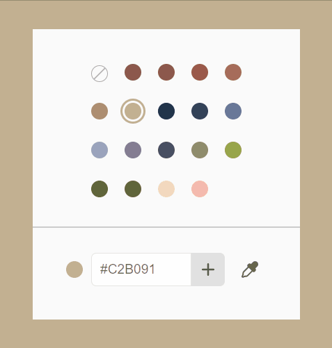
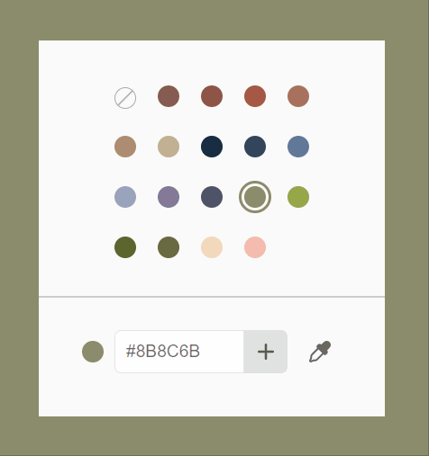
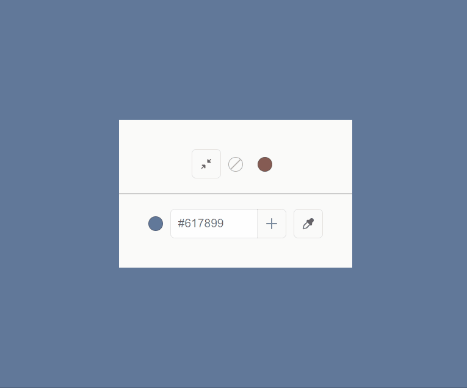
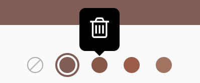
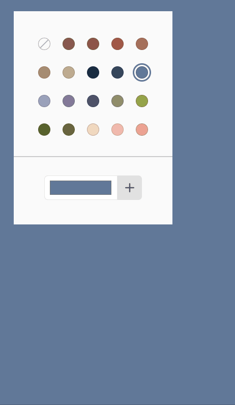

<p align="center">
    
</p>
<p align="center">
    Svelte component to display a customisable color picker
</p>

---

[](https://www.npmjs.com/package/@untemps/svelte-palette)
[](https://github.com/untemps/svelte-palette/actions)
[](https://codecov.io/gh/untemps/svelte-palette)

## Demo

<p align="center">
    :red_circle:&nbsp;<big><a href="https://untemps.github.io/svelte-palette" target="_blank" rel="noopener">LIVE
    DEMO</a></big>&nbsp;:red_circle:
</p>

## Installation

```bash
yarn add @untemps/svelte-palette
```

## Usage

### Basic usage

```html
<script>
    import { Palette } from '@untemps/svelte-palette'

    const colors = [
		'#865C54',
		'#8F5447',
		'#A65846',
		'#A9715E',
		'#AD8C72',
    ]

	let bgColor = colors[0]
</script>

<main style="--bgColor:{bgColor}">
	<Palette {colors} allowDuplicates deletionMode="tooltip" on:select={({ detail: { color } }) => (bgColor = color)} />
</main>

<style>
	main {
		display: flex;
		align-items: center;
		justify-content: center;
		height: 100%;
		background-color: var(--bgColor);
	}
```

## API

| Props                    | Type     | Default | Description                                                                                                                                                                                               |
|--------------------------|----------|---------|-----------------------------------------------------------------------------------------------------------------------------------------------------------------------------------------------------------|
| `colors`                 | string[] | []      | Array of color strings to be displayed in the palette.                                                                                                                                                    |
| `compactColorIndices`    | number[] | []      | Array of indices to pick from the `colors` array to be displayed in the compacted palette (see [Compact Mode](#compact-mode))                                                                             |
| `selectedColor`          | string   | null    | Default selected color. The color must be included in the `colors` prop.                                                                                                                                  |
| `allowDuplicates`        | boolean  | false   | Flag to allow color duplication.                                                                                                                                                                          |
| `deletionMode`           | string   | "none"  | Mode of slot deletion, between `"none"` and `"tooltip"` and `"drop"` (see [Deletion Modes](#deletion-modes)).                                                                                             |
| `allowDeletion`          | string   | "none"  | (deprecated) Flag to allow color deletion. If false, equivalent to `deletionMode='none'`. If true, equivalent to `deletionMode='tooltip'`.                                                                |
| `tooltipClassName`       | string   | null    | Class name to pass down to the deletion tooltip (see [Styles](#styles)).                                                                                                                                  |
| `tooltipContentSelector` | string   | null    | Selector of the deletion tooltip content (see [Customize the Content of the Deletion Tooltip](#customize-the-content-of-the-deletion-tooltip)).                                                           |
| `showTransparentSlot`    | boolean  | false   | Flag to display a transparent slot at the start of the slot list.                                                                                                                                         |
| `maxColors`              | number   | 30      | Maximum number of slots to be displayed in the palette. Set this value to `-1` to allow infinite number of slots.                                                                                         |
| `inputType`              | string   | "text"  | Type of the input within the footer slot. Only "text" and "color" are allowed. All other value will be replaced by "text".                                                                                |
| `numColumns`             | number   | 5       | Number of columns of the palette grid. This value can't exceed the number of maximum colors defined in `maxColors` and can't be lower than 1. Set this value to `0` to display the slots on a single row. |
| `transition`             | object   | null    | Animation when a slot is rendered (see [Transition](#transition))                                                                               |

## Events

| Event    | Arguments | Type   | Description                                |
| -------- | --------- | ------ | ------------------------------------------ |
| `select` |           |        | **Dispatched whenever a color is clicked** |
|          | `color`   | string | Selected color string.                     |

## Slots

| Slot               | Description                                                                                                                                                |
| ------------------ | ---------------------------------------------------------------------------------------------------------------------------------------------------------- |
| `header`           | Allow to add a header to the palette. By default, it is empty.                                                                                             |
| `header-divider`   | Allow to add a divider between the header and the slots. This slot is added only if the header slot is set. By default, it displays a simple grey \<hr/\>. |
| `footer`           | Allow to add a footer to the palette. By default, it contains an input to add colors.                                                                      |
| `footer-divider`   | Allow to add a divider between the slots and the footer. By default, it displays a simple grey \<hr/\>.                                                    |
| `slot`             | Allow to replace the default color slots                                                                                                                   |
| `transparent-slot` | Allow to replace the default transparent slot                                                                                                              |
| `input`            | Allow to replace the input in the footer if the default footer slot is kept as it is                                                                       |

## Example

```html
<script>
	import { Palette } from '@untemps/svelte-palette'

	const colors = ['#865C54', '#8F5447', '#A65846', '#A9715E', '#AD8C72']
</script>

<Palette {colors}>
	<div slot="header" class="palette__header">
		<h1>Pick a color</h1>
	</div>
	<hr slot="header-divider" class="palette__divider" />
	<button let:color slot="slot" class="palette__slot" style="--color:{color}" />
	<hr slot="header-divider" class="palette__divider" />
	<div slot="footer" class="palette__footer">
		<a href="https://www.untemps.net">@untemps</a>
	</div>
</Palette>

<style>
	.palette__header {
		display: flex;
		justify-content: center;
	}

	.palette__slot {
		cursor: pointer;
		width: 2rem;
		height: 2rem;
		margin: 0;
		background-color: var(--color);
		border-radius: 20%;
		border: 1px solid rgba(0, 0, 0, 0.2);
		box-shadow: 0.1rem 0.1rem 0.3rem rgba(0, 0, 0, 0.2);
	}

	.palette__footer {
		display: flex;
		justify-content: center;
		padding: 0.5rem;
	}

	.palette__divider {
		border: #ccc dashed 1px;
		width: 50%;
	}
</style>
```

# Deletion Modes

The `deletionMode` prop allows to define the way users can delete (or not) the color slots:

| Value     | Description                                                                                                                                                                                 |
|-----------|---------------------------------------------------------------------------------------------------------------------------------------------------------------------------------------------|
| `none`    | (Default) Color slots cannot be deleted                                                                                                                                                     |
| `tooltip` | A tooltip is displayed when hovering a color slot, a click within deletes the slot  <br/>(You can control tooltip display though the `tooltipClassName` and `tooltipContentSelector` props) |
| `drop`    | Colors slots are draggable, a drop outside the palette deletes the slot                                                                                                                     |

As an helper, deletion mode enums are exported in `PaletteDeletionMode`.

# Compact Mode

The compact mode is a way to display a minimal version of the palette with a restricted selection of the original colors and downsized spaces. 

The `compactColorIndices` prop allows to define the list of the colors to be picked from the `colors` array by their indices.  
If set, a control is added to toggle the compact mode.

```html
<script>
	import { Palette } from '@untemps/svelte-palette'

	const colors = ['#865C54', '#8F5447', '#A65846', '#A9715E', '#AD8C72']
	const compactColorIndices = [1, 3, 4]
</script>

<Palette {colors} {compactColorIndices} />
```

# Styles

### Root tag class

You can style the component by passing a class down to the root tag (`section`).

> Note that the class has to be global to be available in the Palette component (see example).

#### Example

```html
<script>
	import { Palette } from '@untemps/svelte-palette'

	const colors = ['#865C54', '#8F5447', '#A65846', '#A9715E', '#AD8C72']
</script>

<Palette {colors} class="palette" />

<style>
	:global(.palette) {
		max-width: 300px;
		display: flex;
		flex-direction: column;
		align-items: center;
		row-gap: 1rem;
		padding: 2rem;
		background: white;
		box-shadow: 0 0 10px 5px rgba(0, 0, 0, 0.18);
	}
</style>
```

### Deletion tooltip class

If you set `deletionMode` to `"tooltip"`, you can pass a class name that is set to the tooltip shown when hovering a slot.

To do so, set a **global** class name to the `tooltipClassName` prop.
> As the tooltip is interactive, make sure you define a sufficient hover area that allow to access the content of the tooltip before the leave event is triggered.

If you ignore that prop, a default class is used.  
>Please note that the default class name is `__tooltip__default`.  
Provide a different class name otherwise the default class would have the precedence over the custom one.

#### Example

```html
<script>
	import { Palette } from '@untemps/svelte-palette'

	const colors = ['#865C54', '#8F5447', '#A65846', '#A9715E', '#AD8C72']
</script>

<Palette {colors} deletionMode="tooltip" tooltipClassName="tooltip" />

<style>
	:global(.tooltip) {
		position: absolute;
		z-index: 9999;
		max-width: 120px;
		background-color: black;
		color: #fff;
		text-align: center;
		border-radius: 6px;
		padding: 0.5rem;
	}
</style>
```

## EyeDropper API Support

If supported by the browser, the default component within the `input` slot displays a button to trigger the [Web EyeDropper API](https://developer.mozilla.org/en-US/docs/Web/API/EyeDropper).  
The tool allows to pick a color from the screen.



Once selected, the color is inserted in the input waiting for the user to submit and adding it to the palette.

If the API is not available, nothing will be rendered.

> The PaletteEyeDropper component can be used on its own anywhere within a slot or in an external component as it is exported from this lib.

## Transition



You can customize the way slots appear into the palette by using the `transition` prop.

This prop works the same way as the [in/out directive](https://svelte.dev/docs#template-syntax-element-directives-in-fn-out-fn) and accepts an object with two properties :

| Value  | Description                                                                                        |
|--------|----------------------------------------------------------------------------------------------------|
| `fn`   | Transition function (See [Svelte Transitions](https://svelte.dev/docs#run-time-svelte-transition)) |
| `args` | Parameters to pass to the transition function                                                      |

`fn` may be one of the [Svelte exported functions](https://svelte.dev/docs#run-time-svelte-transition) or a custom one as described in the [docs](https://svelte.dev/docs#template-syntax-element-directives-transition-fn-custom-transition-functions).

### Example

```html
<script>
    import { Palette } from '@untemps/svelte-palette'
    import { elasticOut } from 'svelte/easing'

    const colors = ['#865C54', '#8F5447', '#A65846', '#A9715E', '#AD8C72']

    const whoosh = (node, params) => {
        const existingTransform = getComputedStyle(node).transform.replace('none', '');

        return {
            delay: params.delay || 0,
            duration: params.duration || 400,
            easing: params.easing || elasticOut,
            css: (t, u) => `transform: ${existingTransform} scale(${t})`
        };
    }
</script>

<Palette colors={colors} transition={{ fn: whoosh, args: { duration: 3000 } }} />
```

## Recipes

### Customize the Content of the Deletion Tooltip

By default, if `deletionMode` is set to `"tooltip"`, the tooltip displays a trash icon:



You may want to display a different content for various purposes.  
That is possible by defining a DOM element selector to the `tooltipContentSelector` prop.

> Note the piece of DOM used ad content is deeply cloned using [cloneNode()](https://developer.mozilla.org/fr/docs/Web/API/Node/cloneNode) before appending to the tooltip container.  
> That means the original element stays as it is but depending on element some props or behaviours may be removed from the clone.

#### Example

```html
<script>
	import { Palette } from '@untemps/svelte-palette'

	const colors = ['#865C54', '#8F5447', '#A65846', '#A9715E', '#AD8C72']
</script>

<Palette {colors} deletionMode="tooltip" tooltipContentSelector=".palette__tooltip__button" />

<!-- The element used as tooltip content -->
<button class="palette__tooltip__button">Delete</button>
```

### Use a color input

By default, the input that allows to add a new slot in the palette is typed as "text".

Although you may use the `ìnput` slot to display a custom component, it is possible to turn the input into color mode by setting the `inputType` prop to "color".  
That unlocks the color picker provided by the browser. Therefore the color spot and the eyedropper are hidden.



#### Example

```html
<script>
	import { Palette } from '@untemps/svelte-palette'

	const colors = ['#865C54', '#8F5447', '#A65846', '#A9715E', '#AD8C72']
</script>

<Palette {colors} inputType="color" />
```

## Development

The component can be served for development purpose on `http://localhost:5000/` running:

```
yarn dev
```

## Contributing

Contributions are warmly welcomed:

-   Fork the repository
-   Create a feature branch
-   Develop the feature AND write the tests (or write the tests AND develop the feature)
-   Commit your changes
    using [Angular Git Commit Guidelines](https://github.com/angular/angular.js/blob/master/DEVELOPERS.md#-git-commit-guidelines)
-   Submit a Pull Request
