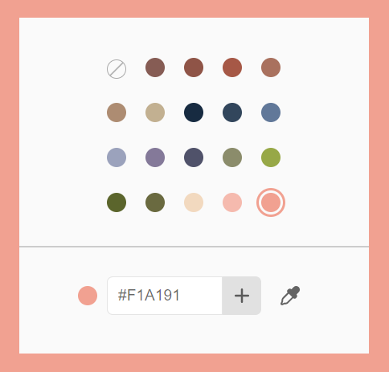

<p align="center">
    
</p>
<p align="center">
    Svelte component to display a customisable color picker
</p>

---

[](https://www.npmjs.com/package/@untemps/svelte-palette)
[](https://github.com/untemps/svelte-palette/actions)
[](https://codecov.io/gh/untemps/svelte-palette)

## Demo

<p align="center">
    :red_circle:&nbsp;&nbsp;<big><a href="https://untemps.github.io/svelte-palette" target="_blank" rel="noopener">LIVE
    DEMO</a></big>&nbsp;:red_circle:
</p>

## Installation

```bash
yarn add @untemps/svelte-palette
```

## Usage

### Basic usage

```html
<script>
    import { Palette } from '@untemps/svelte-palette'

    const colors = [
		'#865C54',
		'#8F5447',
		'#A65846',
		'#A9715E',
		'#AD8C72',
    ]

	let bgColor = colors[0]
</script>

<main style="--bgColor:{bgColor}">
	<Palette {colors} allowDuplicates allowDeletion on:select={({ detail: { color } }) => (bgColor = color)} />
</main>

<style>
	main {
		display: flex;
		align-items: center;
		justify-content: center;
		height: 100%;
		background-color: var(--bgColor);
	}
```

## API

| Props                    | Type    | Default | Description                                                                                                                                     |
|--------------------------| ------- | ------- |-------------------------------------------------------------------------------------------------------------------------------------------------|
| `colors`                 | array   | []      | Array of color strings to be displayed in the palette.                                                                                          |
| `selectedColor`          | string  | null    | Default selected color. The color must be included in the `colors` prop.                                                                        |
| `allowDuplicates`        | boolean | false   | Flag to allow color duplication.                                                                                                                |
| `allowDeletion`          | boolean | false   | Flag to allow color deletion.                                                                                                                   |
| `tooltipClassName`       | string  | null    | Class name to pass down to the deletion tooltip (see [Styles](#styles)).                                                                        |
| `tooltipContentSelector` | string  | null    | Selector of the deletion tooltip content (see [Customize the Content of the Deletion Tooltip](#customize-the-content-of-the-deletion-tooltip)). |
| `showTransparentSlot`    | boolean | false   | Flag to display a transparent slot at the start of the slot list.                                                                               |
| `maxColors`              | number  | 30      | Maximum number of slots to be displayed in the palette. Set this value to `-1` to allow infinite number of slots                                |

## Events

| Event    | Arguments | Type   | Description                                |
| -------- | --------- | ------ | ------------------------------------------ |
| `select` |           |        | **Dispatched whenever a color is clicked** |
|          | `color`   | string | Selected color string.                     |

## Slots

| Slot               | Description                                                                                                                                                |
| ------------------ | ---------------------------------------------------------------------------------------------------------------------------------------------------------- |
| `header`           | Allow to add a header to the palette. By default, it is empty.                                                                                             |
| `header-divider`   | Allow to add a divider between the header and the slots. This slot is added only if the header slot is set. By default, it displays a simple grey \<hr/\>. |
| `footer`           | Allow to add a footer to the palette. By default, it contains an input to add colors.                                                                      |
| `footer-divider`   | Allow to add a divider between the slots and the footer. By default, it displays a simple grey \<hr/\>.                                                    |
| `slot`             | Allow to replace the default color slots                                                                                                                   |
| `transparent-slot` | Allow to replace the default transparent slot                                                                                                              |
| `input`            | Allow to replace the input in the footer if the default footer slot is kept as it is                                                                       |

## Example

```html
<script>
	import { Palette } from '@untemps/svelte-palette'

	const colors = ['#865C54', '#8F5447', '#A65846', '#A9715E', '#AD8C72']
</script>

<Palette {colors}>
	<div slot="header" class="palette__header">
		<h1>Pick a color</h1>
	</div>
	<hr slot="header-divider" class="palette__divider" />
	<button let:color slot="slot" class="palette__slot" style="--color:{color}" />
	<hr slot="header-divider" class="palette__divider" />
	<div slot="footer" class="palette__footer">
		<a href="https://www.untemps.net">@untemps</a>
	</div>
</Palette>

<style>
	.palette__header {
		display: flex;
		justify-content: center;
	}

	.palette__slot {
		cursor: pointer;
		width: 2rem;
		height: 2rem;
		margin: 0;
		background-color: var(--color);
		border-radius: 20%;
		border: 1px solid rgba(0, 0, 0, 0.2);
		box-shadow: 0.1rem 0.1rem 0.3rem rgba(0, 0, 0, 0.2);
	}

	.palette__footer {
		display: flex;
		justify-content: center;
		padding: 0.5rem;
	}

	.palette__divider {
		border: #ccc dashed 1px;
		width: 50%;
	}
</style>
```

# Styles

### Root tag class

You can style the component by passing a class down to the root tag (`section`).

> Note that the class has to be global to be available in the Palette component (see example).

#### Example

```html
<script>
	import { Palette } from '@untemps/svelte-palette'

	const colors = ['#865C54', '#8F5447', '#A65846', '#A9715E', '#AD8C72']
</script>

<Palette {colors} class="palette" />

<style>
	:global(.palette) {
		max-width: 300px;
		display: flex;
		flex-direction: column;
		align-items: center;
		row-gap: 1rem;
		padding: 2rem;
		background: white;
		box-shadow: 0 0 10px 5px rgba(0, 0, 0, 0.18);
	}
</style>
```

### Deletion tooltip class

If you set `allowDeletion` to true, you can pass a class name that is set to the tooltip shown when hovering a slot.

To do so, set a **global** class name to the `tooltipClassName` prop.
> As the tooltip is interactive, make sure you define a sufficient hover area that allow to access the content of the tooltip before the leave event is triggered.

If you ignore that prop, a default class is used.  
>Please note that the default class name is `__tooltip__default`.  
Provide a different class name otherwise the default class would have the precedence over the custom one.

#### Example

```html
<script>
	import { Palette } from '@untemps/svelte-palette'

	const colors = ['#865C54', '#8F5447', '#A65846', '#A9715E', '#AD8C72']
</script>

<Palette {colors} allowDeletion tooltipClassName="tooltip" />

<style>
	:global(.tooltip) {
		position: absolute;
		z-index: 9999;
		max-width: 120px;
		background-color: black;
		color: #fff;
		text-align: center;
		border-radius: 6px;
		padding: 0.5rem;
	}
</style>
```

## Recipes

### Customize the Content of the Deletion Tooltip

By default, if `allowDeletion` is set to true, the tooltip that allows to delete a color slot displays a trash icon:

<p align="center">
    
</p>

You may want to display a different content for various purposes.  
That is possible by defining a DOM element selector to the `tooltipContentSelector` prop.

> Note the piece of DOM used ad content is deeply cloned using [cloneNode()](https://developer.mozilla.org/fr/docs/Web/API/Node/cloneNode) before appending to the tooltip container.  
> That means the original element stays as it is but depending on element some props or behaviours may be removed from the clone.

#### Example

```html
<script>
	import { Palette } from '@untemps/svelte-palette'

	const colors = ['#865C54', '#8F5447', '#A65846', '#A9715E', '#AD8C72']
</script>

<Palette {colors} allowDeletion tooltipContentSelector=".palette__tooltip__button" />

<!-- The element used as tooltip content -->
<button class="palette__tooltip__button">Delete</button>
```

## Development

The component can be served for development purpose on `http://localhost:5000/` running:

```
yarn dev
```

## Contributing

Contributions are warmly welcomed:

-   Fork the repository
-   Create a feature branch
-   Develop the feature AND write the tests (or write the tests AND develop the feature)
-   Commit your changes
    using [Angular Git Commit Guidelines](https://github.com/angular/angular.js/blob/master/DEVELOPERS.md#-git-commit-guidelines)
-   Submit a Pull Request
