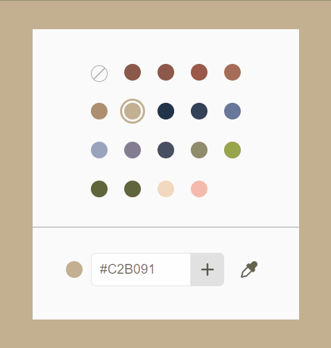
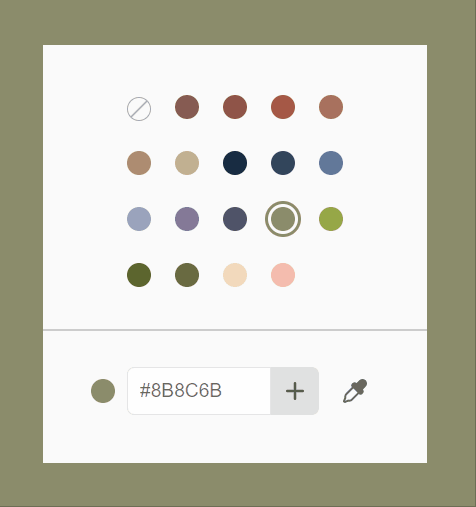
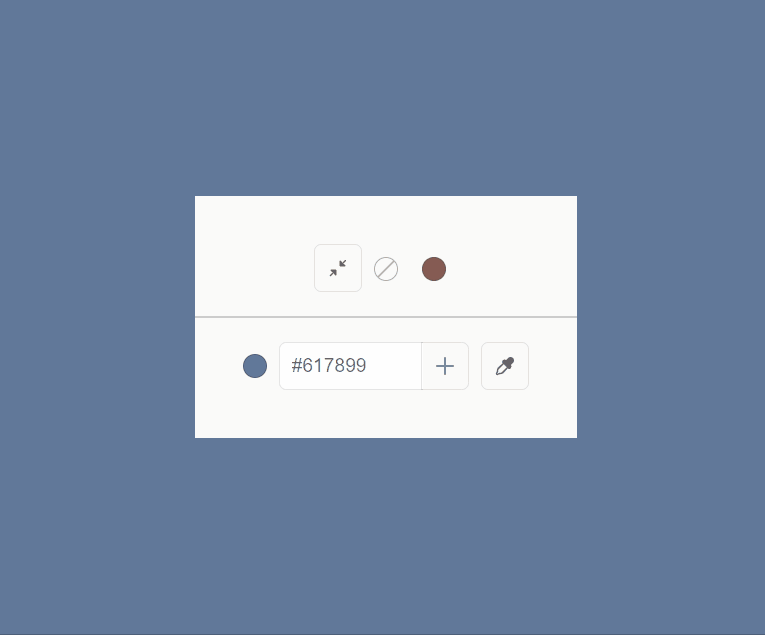
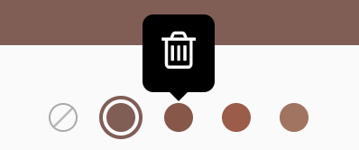
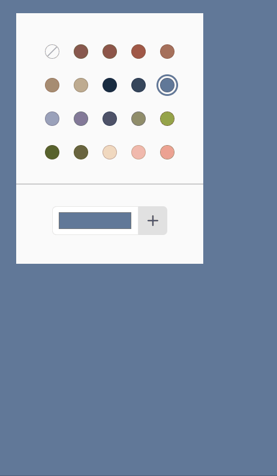

<p align="center">
    
</p>
<p align="center">
    Svelte component to display a customisable color picker
</p>

---

[](https://www.npmjs.com/package/@untemps/svelte-palette)
[](https://github.com/untemps/svelte-palette/actions)
[](https://codecov.io/gh/untemps/svelte-palette)

## Demo

<p align="center">
    :red_circle:&nbsp;<big><a href="https://svelte-palette.vercel.app" target="_blank" rel="noopener">LIVE
    DEMO</a></big>
</p>

## Installation

```bash
yarn add @untemps/svelte-palette
```

> Requires Svelte 5. For Svelte 4 support, use version 4.x.

## Usage

### Basic Usage

```svelte
<script>
    import { Palette } from '@untemps/svelte-palette'

    const colors = [
		'#865C54',
		'#8F5447',
		'#A65846',
		'#A9715E',
		'#AD8C72',
    ]

	let bgColor = colors[0]
</script>

<main style="--bgColor:{bgColor}">
	<Palette {colors} onselect={({ color }) => (bgColor = color)} />
</main>

<style>
	main {
		display: flex;
		align-items: center;
		justify-content: center;
		height: 100%;
		background-color: var(--bgColor);
	}
```

## API

| Props                    | Type                                                                                                    | Default       | Description                                                                                                                                                                                                                                                                                                                                                                                 |
| ------------------------ | ------------------------------------------------------------------------------------------------------- | ------------- | ------------------------------------------------------------------------------------------------------------------------------------------------------------------------------------------------------------------------------------------------------------------------------------------------------------------------------------------------------------------------------------------- |
| `colors`                 | string[] or Promise<string[]> or object[] or Promise<object[]> or ColorGroup[] or Promise<ColorGroup[]> | []            | Array of colors to be displayed in the palette. Pass an array of `{ name, colors }` objects to display grouped collections. Supports `bind:colors`: internal add/delete mutations are written back in the resolved, normalized `{ value, name? }` form (a passed `Promise` or `string[]` is replaced by that value). See more about colors in the [Colors Setting](#colors-setting) section |
| `selectedColor`          | string                                                                                                  | null          | Default selected color. The color must be included in the `colors` prop. Supports `bind:selectedColor`.                                                                                                                                                                                                                                                                                     |
| `isCompact`              | boolean                                                                                                 | false         | Flag to display the palette in compact mode.                                                                                                                                                                                                                                                                                                                                                |
| `compactColorIndices`    | number[]                                                                                                | []            | Array of indices to pick from the `colors` array to be displayed in the compacted palette (see [Compact Mode](#compact-mode)). Supports `bind:compactColorIndices`: it is re-indexed when a compact swatch is deleted.                                                                                                                                                                      |
| `allowDuplicates`        | boolean                                                                                                 | false         | Flag to allow color duplication.                                                                                                                                                                                                                                                                                                                                                            |
| `deletionMode`           | string                                                                                                  | "none"        | Mode of slot deletion, between `"none"` and `"tooltip"` and `"drop"` (see [Deletion Modes](#deletion-modes)).                                                                                                                                                                                                                                                                               |
| `tooltipClassName`       | string                                                                                                  | null          | Class name to pass down to the deletion tooltip (see [Styles](#styles)).                                                                                                                                                                                                                                                                                                                    |
| `tooltipContentSelector` | string                                                                                                  | null          | Selector of the deletion tooltip content (see [Customize the Content of the Deletion Tooltip](#customize-the-content-of-the-deletion-tooltip)).                                                                                                                                                                                                                                             |
| `showTransparentSlot`    | boolean                                                                                                 | false         | Flag to display a transparent slot at the start of the slot list.                                                                                                                                                                                                                                                                                                                           |
| `maxColors`              | number                                                                                                  | 30            | Maximum number of slots to be displayed in the palette. Set this value to `-1` to allow infinite number of slots.                                                                                                                                                                                                                                                                           |
| `showInput`              | boolean                                                                                                 | false         | Flag to display the input within the footer slot.                                                                                                                                                                                                                                                                                                                                           |
| `inputType`              | string                                                                                                  | "text"        | Type of the input within the footer slot. Only "text" and "color" are allowed. All other value will be replaced by "text".                                                                                                                                                                                                                                                                  |
| `numColumns`             | number                                                                                                  | 5             | Number of columns of the palette grid. This value can't exceed the number of maximum colors defined in `maxColors` and can't be lower than 1. Set this value to `0` to display the slots on a single row.                                                                                                                                                                                   |
| `maxColumns`             | number                                                                                                  | 0             | Maximum number of columns when `numColumns` is set to `0`. Once reached, additional slots wrap to a new row. Set this value to `0` to allow unlimited columns.                                                                                                                                                                                                                              |
| `transition`             | object                                                                                                  | null          | Animation when a slot is rendered (see [Transition](#transition)).                                                                                                                                                                                                                                                                                                                          |
| `focusColor`             | string                                                                                                  | "blue"        | Color of the focus outline drawn on a slot when it receives keyboard focus. Can also be set through the `--focusColor` CSS variable (see [Styles](#focus-outline-color)).                                                                                                                                                                                                                   |
| `label`                  | string                                                                                                  | "Color slots" | Accessible name announced for the slot listbox (see [Accessibility](#accessibility)).                                                                                                                                                                                                                                                                                                       |
| `presentational`         | boolean                                                                                                 | false         | Renders the slot grid as a purely visual display: drops the `listbox`/`option` roles, the single tab stop and the arrow-key navigation. Use it for decorative palettes that are not meant to be picked from (see [Accessibility](#accessibility)).                                                                                                                                          |

## Callbacks

| Prop       | Arguments    | Type                     | Description                                                                          |
| ---------- | ------------ | ------------------------ | ------------------------------------------------------------------------------------ |
| `onselect` |              |                          | **Called whenever a color is clicked.**                                              |
|            | `color`      | string                   | Selected color string.                                                               |
| `onadd`    |              |                          | **Called once a color has been added to the list through the input.**                |
|            | `color`      | string                   | The color value that was added.                                                      |
|            | `colors`     | object[] or ColorGroup[] | The resulting color list, in its resolved and normalized form.                       |
| `ondelete` |              |                          | **Called once a color has been removed from the list through the deletion gesture.** |
|            | `color`      | string                   | The color value that was removed.                                                    |
|            | `index`      | number                   | Index of the removed color within its list (or group in grouped mode).               |
|            | `colors`     | object[] or ColorGroup[] | The resulting color list, in its resolved and normalized form.                       |
|            | `groupIndex` | number                   | Index of the group the color was removed from (grouped mode only).                   |
|            | `groupName`  | string                   | Name of the group the color was removed from (grouped mode only, when named).        |

## Snippets

Snippets replace the Svelte 4 named slots API. Pass them as children of `<Palette>` using the `{#snippet name(props)}` syntax.

| Snippet           | Description                                                                           | Available Properties                                                                                                                             |
| ----------------- | ------------------------------------------------------------------------------------- | ------------------------------------------------------------------------------------------------------------------------------------------------ |
| `header`          | Allow to add a header to the palette. By default, it is empty.                        | `selectedColor`                                                                                                                                  |
| `footer`          | Allow to add a footer to the palette. By default, it contains an input to add colors. | `selectedColor`                                                                                                                                  |
| `slot`            | Allow to replace the default color slots.                                             | `index`, `color`, `colorName`, `groupName`, `selectedColor`, `selected`, `transition`, `isCompact`, `tabindex`, `focusColor`, `ariaKeyShortcuts` |
| `transparentSlot` | Allow to replace the default transparent slot.                                        | `tabindex`, `selected`, `focusColor`                                                                                                             |
| `beforeSlot`      | Allow to add an element before the color slots.                                       | `selectedColor`, `transition`, `isCompact`                                                                                                       |
| `afterSlot`       | Allow to add an element after the color slots.                                        | `selectedColor`, `transition`, `isCompact`                                                                                                       |
| `input`           | Allow to replace the input in the footer if the default footer snippet is kept as is. | `selectedColor`, `inputType`                                                                                                                     |
| `settings`        | Allow to replace the settings panel. See the demo to grab a usage example.            | `onClose`                                                                                                                                        |
| `tools`           | Allow to replace the tools panel.                                                     | `isCompact`, `compactColorIndices`, `onSelect`                                                                                                   |
| `loader`          | Allow to replace the loader displayed during the colors async retrieving.             | -                                                                                                                                                |

## Example

```svelte
<script>
	import { Palette } from '@untemps/svelte-palette'

	const colors = ['#865C54', '#8F5447', '#A65846', '#A9715E', '#AD8C72']
</script>

<Palette {colors}>
	{#snippet header()}
		<div class="palette__header">
			<h1>Pick a color</h1>
		</div>
	{/snippet}
	{#snippet slot({ color })}
		<button class="palette__slot" style="--color:{color}"></button>
	{/snippet}
	{#snippet footer()}
		<div class="palette__footer">
			<a href="https://www.untemps.net">@untemps</a>
		</div>
	{/snippet}
</Palette>

<style>
	.palette__header {
		display: flex;
		justify-content: center;
	}

	.palette__slot {
		cursor: pointer;
		width: 2rem;
		height: 2rem;
		margin: 0;
		background-color: var(--color);
		border-radius: 20%;
		border: 1px solid rgba(0, 0, 0, 0.2);
		box-shadow: 0.1rem 0.1rem 0.3rem rgba(0, 0, 0, 0.2);
	}

	.palette__footer {
		display: flex;
		justify-content: center;
		padding: 0.5rem;
	}
</style>
```

# Colors Setting

Color can be set in several formats:

## Array of Color Strings

```
colors = ['#865C54', '#8F5447', '#A65846']
```

## Array of Color Objects

```
colors = [
	{ name: 'Color #1', value: '#865C54' },
	{ name: 'Color #2', value: '#8F5447' },
	{ value: '#A65846' }
]
```

## Array of Color Groups

Colors can be organized into named groups by passing an array of `ColorGroup` objects:

```
colors = [
	{ name: 'Warm', colors: ['#865C54', '#8F5447', '#A65846'] },
	{ name: 'Cool', colors: ['#172B41', '#32465C', '#617899'] },
	{ colors: ['#8B8C6B', '#97A847'] }
]
```

Each group has:

- `name` (optional) — displayed as a label above the group
- `colors` — array of color strings or color objects

When groups are used, compact mode and the color input are not available. The `colorSlot` snippet receives an additional `groupName` parameter.

## Promise

A promise to be resolved with an array of color strings, objects, or groups can be passed as well (see [Use an API to fill the palette](#use-an-api-to-fill-the-palette))

# Deletion Modes

The `deletionMode` prop allows to define the way users can delete (or not) the color slots:

| Value     | Description                                                                                                                                                                                |
| --------- | ------------------------------------------------------------------------------------------------------------------------------------------------------------------------------------------ |
| `none`    | (Default) Color slots cannot be deleted                                                                                                                                                    |
| `tooltip` | A tooltip is displayed when hovering a color slot, a click within deletes the slot <br/>(You can control tooltip display though the `tooltipClassName` and `tooltipContentSelector` props) |
| `drop`    | Colors slots are draggable, a drop outside the palette deletes the slot                                                                                                                    |

As an helper, deletion mode enums are exported in `PaletteDeletionMode`.

# Compact Mode

The compact mode is a way to display a minimal version of the palette with a restricted selection of the original colors and downsized spaces.

The `compactColorIndices` prop allows to define the list of the colors to be picked from the `colors` array by their indices.
If set a control is added to toggle the compact mode.

You may also specified whether the palette has to use the compact mode by default by setting `isCompact=true`.

```svelte
<script>
	import { Palette } from '@untemps/svelte-palette'

	const colors = ['#865C54', '#8F5447', '#A65846', '#A9715E', '#AD8C72']
	const compactColorIndices = [1, 3, 4]
</script>

<Palette {colors} {compactColorIndices} />
```

Deleting a compact swatch removes the mapped color from the underlying full `colors` list (not just from the compact view), fires `ondelete` with that color's index in the full list, and re-indexes `compactColorIndices`. Both `colors` and `compactColorIndices` support `bind:` so the mutation can be persisted; pass a stable reference (or bind it) for `compactColorIndices` so the re-index is not overwritten on the next render.

# Accessibility

The slot grid follows the [ARIA listbox pattern](https://www.w3.org/WAI/ARIA/apg/patterns/listbox/) so it behaves as a single composite widget for keyboard and screen-reader users.

- **Listbox semantics** — the grid is exposed as a `listbox` and each slot as an `option` whose selection state is reflected through `aria-selected`. Name the listbox with the [`label`](#api) prop (defaults to `"Color slots"`). When colors are grouped, each group is a labelled `group` associated with its name.
- **Single tab stop** — the whole grid takes a single tab stop instead of one per slot. `Tab` moves focus onto the selected slot (or the first one when nothing is selected), then out of the grid.
- **Arrow-key navigation** — once a slot is focused, move within the grid with the keyboard:

| Key                    | Action                                                 |
| ---------------------- | ------------------------------------------------------ |
| `←` / `→`              | Move to the previous / next slot                       |
| `↑` / `↓`              | Move up / down one row                                 |
| `Home` / `End`         | Move to the first / last slot                          |
| `Enter` / `Space`      | Select the focused slot                                |
| `Delete` / `Backspace` | Remove the focused slot (when a `deletionMode` is set) |

Arrow keys only move focus; the selection (and the `onselect` callback) is triggered on `Enter`, `Space` or a click, so navigating the grid never changes the selected color on its own. In grouped palettes each group is a row: `↑` / `↓` move to the slot at the same position in the adjacent group (clamped to that group's length).

When a `deletionMode` (`"tooltip"` or `"drop"`) is set, `Delete` or `Backspace` removes the focused slot and moves focus to the neighbour that takes its place — the keyboard counterpart of the pointer-only tooltip and drop affordances. The leading transparent slot is never removed, and the keys do nothing when `deletionMode` is `"none"`. To surface that affordance to assistive technologies, deletable slots carry `aria-keyshortcuts="Delete Backspace"` while a `deletionMode` is set, so screen readers announce the shortcut on the focused slot.

> **Custom slots** — the roving tab index is managed automatically for the default slots. Only the [`slot`](#snippets) snippet receives the computed `tabindex` argument: forward it onto your own focusable element and the slot joins the arrow-key navigation — no `role="option"` is required for keyboard access. Also add `role="option"` and `aria-selected={selected}` (the snippet receives a computed `selected` flag that is index-accurate, so with `allowDuplicates` only the first matching slot is marked) so screen readers expose the slot as a selectable option. When you set a `deletionMode`, forward the `ariaKeyShortcuts` argument too (`aria-keyshortcuts={ariaKeyShortcuts}`) so the delete shortcut is announced on your custom slot. A `slot` that ignores `tabindex` keeps working but stays a separate tab stop.
>
> The `beforeSlot` and `afterSlot` snippets render **outside** the `listbox`, stacked before and after the slot grid, so they are not options and are **not** part of the arrow-key navigation. Render them as plain elements (e.g. a `<div>`, **not** an `<li>`), keep any interactive content they hold reachable with `Tab`, and do not give it `role="option"`. The `transparentSlot` snippet, by contrast, replaces the leading option _inside_ the listbox and now receives `tabindex` and `selected`: forward `role="option"`, the `tabindex` argument, and `aria-selected={selected}` onto your element so it stays the single leading tab stop and part of arrow-key navigation.

## Display-only palettes

If a palette is purely decorative — a slot board or a color reference that is not meant to be picked from — set the [`presentational`](#api) prop. The grid then renders as a plain container: no `listbox`/`option` roles, no tab stop and no arrow-key navigation. This avoids exposing an empty `listbox` when you replace the slots with non-interactive `slot` content (e.g. bare `<div>`s). Grouped palettes keep their visible group names as regular text.

```svelte
<Palette {colors} presentational>
	{#snippet slot({ color })}
		<div style="--color: {color}" class="slot"></div>
	{/snippet}
</Palette>
```

## Landmark

The root element is a generic container and does not expose a landmark role. Wrap `<Palette />` in your own `<main>`, `<section aria-label="…">` or other landmark if your page needs one.

# Styles

### Root Tag Class

You can style the component by passing a class down to the root tag (`div`).

- Flag the class as global to make it available in the Palette component
- Prefix your class with `.palette[data-palette]` to give precedence over the default one or mark each style with `!important` (not recommanded)

#### Example

```svelte
<script>
	import { Palette } from '@untemps/svelte-palette'

	const colors = ['#865C54', '#8F5447', '#A65846', '#A9715E', '#AD8C72']
</script>

<Palette {colors} class="palette__custom" />

<style>
	:global(.palette[data-palette].palette__custom) {
		background: yellow;
	}
</style>
```

### Slot Grid Class

The slot grid (columns, gaps) is laid out on the `listbox` element, `.palette__listbox`, not on its `.palette__cells` wrapper — the wrapper is a flex column that stacks the optional `beforeSlot` / `afterSlot` around the grid. Target `.palette__listbox` (e.g. `.palette__cells > .palette__listbox`) to override the flat-mode grid:

```svelte
<style>
	:global(.palette[data-palette].palette__custom > .palette__content > .palette__cells > .palette__listbox) {
		column-gap: 0;
	}
</style>
```

When colors are grouped, each group keeps its own `.palette__cells` grid instead.

### Focus Outline Color

Slots draw a focus outline when they receive keyboard focus. Its color defaults to `blue` and can be customized in two ways:

- Set the `focusColor` prop on `<Palette>` to apply a color to every slot — the default slots **and** custom ones. The palette writes the value to the `--focusColor` CSS variable on its root, so it cascades down to whatever your `slot` / `transparentSlot` snippets render. Those snippets also receive the value as a `focusColor` argument, so you can forward it explicitly (e.g. onto a `<PaletteSlot>`) when you need the raw value.
- Set the `--focusColor` CSS variable on the palette (or any ancestor) yourself: it cascades down the same way, so it also applies when you render `<PaletteSlot>` on your own.

The `focusColor` prop takes precedence over a `--focusColor` variable you set on the palette root or an ancestor, which in turn takes precedence over the `blue` default. (Custom slots receive the prop by inheriting that root variable, so a `--focusColor` you set directly on — or forward onto — a custom slot node wins locally for that slot, as usual for CSS.)

#### Example

```svelte
<script>
	import { Palette } from '@untemps/svelte-palette'

	const colors = ['#865C54', '#8F5447', '#A65846', '#A9715E', '#AD8C72']
</script>

<!-- Through the prop -->
<Palette {colors} focusColor="#0066ff" />

<!-- Or through the CSS variable -->
<Palette {colors} class="palette__custom" />

<style>
	:global(.palette[data-palette].palette__custom) {
		--focusColor: #0066ff;
	}
</style>
```

### Deletion Tooltip Class

If you set `deletionMode` to `"tooltip"`, you can pass a class name that is set to the tooltip shown when hovering a slot.

To do so, set a **global** class name to the `tooltipClassName` prop.

> As the tooltip is interactive, make sure you define a sufficient hover area that allow to access the content of the tooltip before the leave event is triggered.

If you ignore that prop, a default class is used.

> Please note that the default class name is `__tooltip__default`.
> Provide a different class name otherwise the default class would have the precedence over the custom one.

#### Example

```svelte
<script>
	import { Palette } from '@untemps/svelte-palette'

	const colors = ['#865C54', '#8F5447', '#A65846', '#A9715E', '#AD8C72']
</script>

<Palette {colors} deletionMode="tooltip" tooltipClassName="tooltip" />

<style>
	:global(.tooltip) {
		position: absolute;
		z-index: 9999;
		max-width: 120px;
		background-color: black;
		color: #fff;
		text-align: center;
		border-radius: 6px;
		padding: 0.5rem;
	}
</style>
```

## EyeDropper API Support

If supported by the browser, the default component within the `input` snippet displays a button to trigger the [Web EyeDropper API](https://developer.mozilla.org/en-US/docs/Web/API/EyeDropper).
The tool allows to pick a color from the screen.



Once selected, the color is inserted in the input waiting for the user to submit and adding it to the palette.

If the API is not available, nothing will be rendered.

> **Browser compatibility note:** The EyeDropper API specification defines `sRGBHex` as returning a hexadecimal color string (e.g. `#rrggbb`). However, some browsers return an `rgb()` or `rgba()` string instead. The component normalizes the value to hex format automatically.

> The PaletteEyeDropper component can be used on its own anywhere within a snippet or in an external component as it is exported from this lib.

## Transition



You can customize the way slots appear into the palette by using the `transition` prop.

This prop works the same way as the [in/out directive](https://svelte.dev/docs#template-syntax-element-directives-in-fn-out-fn) and accepts an object with two properties :

| Value  | Description                                                                                        |
| ------ | -------------------------------------------------------------------------------------------------- |
| `fn`   | Transition function (See [Svelte Transitions](https://svelte.dev/docs#run-time-svelte-transition)) |
| `args` | Parameters to pass to the transition function                                                      |

`fn` may be one of the [Svelte exported functions](https://svelte.dev/docs#run-time-svelte-transition) or a custom one as described in the [docs](https://svelte.dev/docs#template-syntax-element-directives-transition-fn-custom-transition-functions).

### Example

```svelte
<script>
	import { Palette } from '@untemps/svelte-palette'
	import { elasticOut } from 'svelte/easing'

	const colors = ['#865C54', '#8F5447', '#A65846', '#A9715E', '#AD8C72']

	const whoosh = (node, params) => {
		const existingTransform = getComputedStyle(node).transform.replace('none', '')

		return {
			delay: params.delay || 0,
			duration: params.duration || 400,
			easing: params.easing || elasticOut,
			css: (t, u) => `transform: ${existingTransform} scale(${t})`,
		}
	}
</script>

<Palette {colors} transition={{ fn: whoosh, args: { duration: 3000 } }} />
```

## Recipes

### Use an API to Fill the Palette

In case you want to call an API to fetch the palette colors, you may pass a promise to the `colors` prop.

The component displays a customizable loader waiting to the promise to be resolved. Be aware that the result of the promise must be an array of color strings as well.

#### Example

```svelte
<script>
	import { Palette } from '@untemps/svelte-palette'

	const colors = fetch('https://www.colr.org/json/colors/random/30')
		.then((result) => result.json())
		.then((result) => result.colors.filter((c) => c.hex?.length).map((c) => `#${c.hex}`))
</script>

<Palette {colors}>
	{#snippet loader()}
		<p>Loading...</p>
	{/snippet}
</Palette>
```

### Customize the Content of the Deletion Tooltip

By default, if `deletionMode` is set to `"tooltip"`, the tooltip displays a trash icon:



You may want to display a different content for various purposes.
That is possible by defining a DOM element selector to the `tooltipContentSelector` prop.

> Note the piece of DOM used ad content is deeply cloned using [cloneNode()](https://developer.mozilla.org/fr/docs/Web/API/Node/cloneNode) before appending to the tooltip container.
> That means the original element stays as it is but depending on element some props or behaviours may be removed from the clone.

#### Example

```svelte
<script>
	import { Palette } from '@untemps/svelte-palette'

	const colors = ['#865C54', '#8F5447', '#A65846', '#A9715E', '#AD8C72']
</script>

<Palette {colors} deletionMode="tooltip" tooltipContentSelector=".palette__tooltip__button" />

<!-- The element used as tooltip content -->
<button class="palette__tooltip__button">Delete</button>
```

### Use a Color Input

By default, the input that allows to add a new slot in the palette is typed as "text".

Although you may use the `input` snippet to display a custom component, it is possible to turn the input into color mode by setting the `inputType` prop to "color".
That unlocks the color picker provided by the browser. Therefore the color spot and the eyedropper are hidden.



#### Example

```svelte
<script>
	import { Palette } from '@untemps/svelte-palette'

	const colors = ['#865C54', '#8F5447', '#A65846', '#A9715E', '#AD8C72']
</script>

<Palette {colors} inputType="color" />
```

### Customize the Tools Panel

The tools panel is a container for two actions:

- Display the settings panel (`"settings"`)
- Toggle the compact mode (`"compact"`)

For some use cases, you may want to provide your own controls by using the `tools` snippet.

To access each tool behaviours, the Palette component exports a `onSelect` function that has to be called with the name of the tool (use the enums from the exported `PaletteTool`).

#### Example

```svelte
<script>
	import { Palette, PaletteTool } from '@untemps/svelte-palette'

	const colors = ['#865C54', '#8F5447', '#A65846', '#A9715E', '#AD8C72']
</script>

<Palette {colors}>
	{#snippet tools({ onSelect, isCompact })}
		<div>
			<button onclick={() => onSelect(PaletteTool.SETTINGS)}>Settings</button>
			<button onclick={() => onSelect(PaletteTool.COMPACT)}>{isCompact ? 'Expand' : 'Compact'}</button>
		</div>
	{/snippet}
</Palette>
```

## Development

The component can be served for development purpose on `http://localhost:5173/` running:

```
yarn dev
```

## Contributing

Contributions are warmly welcomed:

- Fork the repository
- Create a feature branch
- Develop the feature AND write the tests (or write the tests AND develop the feature)
- Commit your changes
  using [Angular Git Commit Guidelines](https://github.com/angular/angular.js/blob/master/DEVELOPERS.md#-git-commit-guidelines)
- Submit a Pull Request
