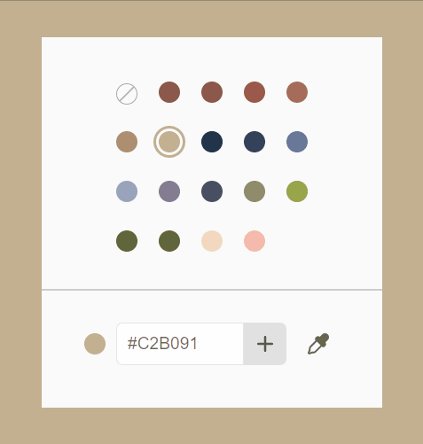
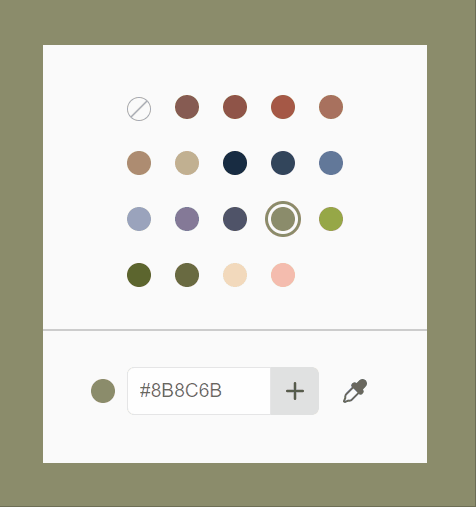
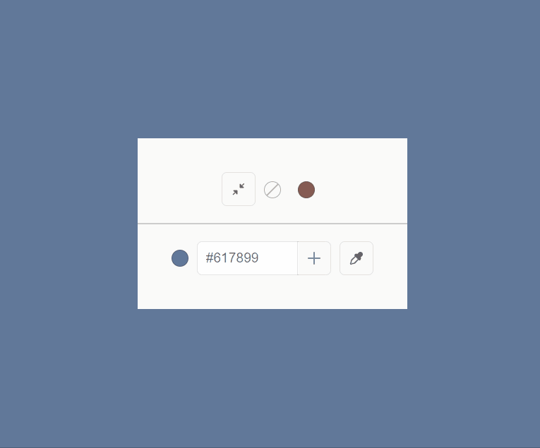
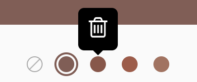
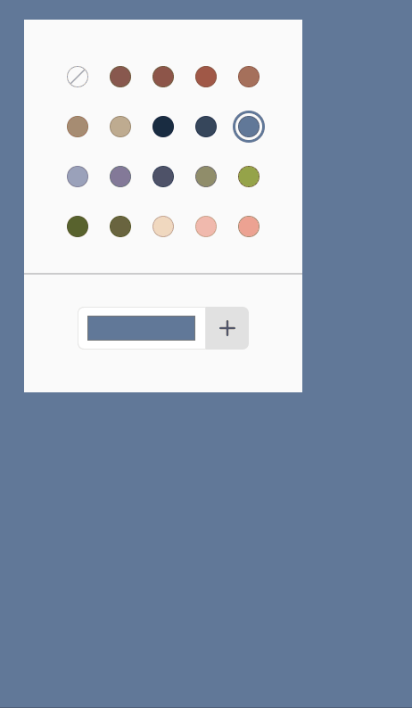

<p align="center">
    
</p>
<p align="center">
    Svelte component to display a customisable color picker
</p>

---

[](https://www.npmjs.com/package/@untemps/svelte-palette)
[](https://github.com/untemps/svelte-palette/actions)
[](https://codecov.io/gh/untemps/svelte-palette)

## Demo

<p align="center">
    :red_circle:&nbsp;<big><a href="https://svelte-palette.vercel.app" target="_blank" rel="noopener">LIVE
    DEMO</a></big>
</p>

## Installation

```bash
yarn add @untemps/svelte-palette
```

> Requires Svelte 5. For Svelte 4 support, use version 4.x.

## Usage

### Basic Usage

```svelte
<script>
	import { Palette } from '@untemps/svelte-palette'

	const colors = ['#865C54', '#8F5447', '#A65846', '#A9715E', '#AD8C72']

	let bgColor = colors[0]
</script>

<main style="--bgColor:{bgColor}">
	<Palette {colors} onselect={({ color }) => (bgColor = color)} />
</main>

<style>
	main {
		display: flex;
		align-items: center;
		justify-content: center;
		height: 100%;
		background-color: var(--bgColor);
	}
</style>
```

## Palette API

| Props                    | Type                                                                                                    | Default | Description                                                                                                                                                                                                                                                                                                                                                                                                                                                                                                                                                                                   |
| ------------------------ | ------------------------------------------------------------------------------------------------------- | ------- | --------------------------------------------------------------------------------------------------------------------------------------------------------------------------------------------------------------------------------------------------------------------------------------------------------------------------------------------------------------------------------------------------------------------------------------------------------------------------------------------------------------------------------------------------------------------------------------------- |
| `colors`                 | string[] or Promise<string[]> or object[] or Promise<object[]> or ColorGroup[] or Promise<ColorGroup[]> | null    | Array of colors to be displayed in the palette. Pass an array of `{ name, colors }` objects to display grouped collections. Supports `bind:colors`: internal add/delete mutations are written back in the resolved, normalized `{ value, name? }` form (a passed `Promise` or `string[]` is replaced by that value). Omitting `colors` (or passing `null`) leaves the palette in its loading state — this is the intended behaviour while an async source is pending; pass `[]` explicitly to render an empty palette. See more about colors in the [Colors Setting](#colors-setting) section |
| `selectedColor`          | string                                                                                                  | null    | Default selected color. The color must be included in the `colors` prop. Supports `bind:selectedColor`.                                                                                                                                                                                                                                                                                                                                                                                                                                                                                       |
| `isCompact`              | boolean                                                                                                 | false   | Flag to display the palette in compact mode.                                                                                                                                                                                                                                                                                                                                                                                                                                                                                                                                                  |
| `compactColorIndices`    | number[]                                                                                                | []      | Array of indices to pick from the `colors` array to be displayed in the compacted palette (see [Compact Mode](#compact-mode)). Supports `bind:compactColorIndices`: it is re-indexed when a compact slot is deleted.                                                                                                                                                                                                                                                                                                                                                                          |
| `allowDuplicates`        | boolean                                                                                                 | false   | Flag to allow color duplication.                                                                                                                                                                                                                                                                                                                                                                                                                                                                                                                                                              |
| `deletionMode`           | string                                                                                                  | "none"  | Mode of slot deletion, between `"none"` and `"tooltip"` and `"drop"` (see [Deletion Modes](#deletion-modes)).                                                                                                                                                                                                                                                                                                                                                                                                                                                                                 |
| `tooltipClassName`       | string                                                                                                  | null    | Class name to pass down to the deletion tooltip (see [Styles](#styles)).                                                                                                                                                                                                                                                                                                                                                                                                                                                                                                                      |
| `tooltipContentSelector` | string                                                                                                  | null    | Selector of the deletion tooltip content (see [Customize the Content of the Deletion Tooltip](#customize-the-content-of-the-deletion-tooltip)).                                                                                                                                                                                                                                                                                                                                                                                                                                               |
| `showTransparentSlot`    | boolean                                                                                                 | false   | Flag to display a transparent slot at the start of the slot list.                                                                                                                                                                                                                                                                                                                                                                                                                                                                                                                             |
| `maxColors`              | number                                                                                                  | 30      | Maximum number of slots to be displayed in the palette. Set this value to `-1` to allow infinite number of slots.                                                                                                                                                                                                                                                                                                                                                                                                                                                                             |
| `showInput`              | boolean                                                                                                 | false   | Flag to display an input to add colors below the palette. The input is not rendered in compact mode, in grouped mode, or while an async `colors` source is still unresolved.                                                                                                                                                                                                                                                                                                                                                                                                                  |
| `inputType`              | string                                                                                                  | "text"  | Type of the color input. Only "text" and "color" are allowed. Any other value will be replaced by "text".                                                                                                                                                                                                                                                                                                                                                                                                                                                                                     |
| `numColumns`             | number                                                                                                  | 5       | Number of columns of the palette grid. Set this value to `0` to display the slots on a single row (see `maxColumns`). Values lower than `0` are treated the same as `0`.                                                                                                                                                                                                                                                                                                                                                                                                                      |
| `maxColumns`             | number                                                                                                  | 0       | Maximum number of columns when `numColumns` is set to `0`. Once reached, additional slots wrap to a new row. Set this value to `0` to allow unlimited columns.                                                                                                                                                                                                                                                                                                                                                                                                                                |
| `transition`             | object                                                                                                  | null    | Animation when a slot is rendered (see [Transition](#transition)).                                                                                                                                                                                                                                                                                                                                                                                                                                                                                                                            |
| `labels`                 | Partial\<PaletteLabels\>                                                                                | {}      | Overrides for the built-in text and accessibility labels. Every key is optional and defaults to the matching `DEFAULT_LABELS` string, so this is a fully additive way to localize the palette or tweak individual labels without replacing any snippet (see [Internationalization](#internationalization)).                                                                                                                                                                                                                                                                                   |
| `presentational`         | boolean                                                                                                 | false   | Renders the slot grid as a purely visual display: drops the `listbox`/`option` roles, the single tab stop and the arrow-key navigation. Use it for decorative palettes that are not meant to be picked from (see [Accessibility](#accessibility)).                                                                                                                                                                                                                                                                                                                                            |

## Callbacks

| Prop       | Arguments    | Type                     | Description                                                                          |
| ---------- | ------------ | ------------------------ | ------------------------------------------------------------------------------------ |
| `onselect` |              |                          | **Called whenever a color is clicked.**                                              |
|            | `color`      | string                   | Selected color string.                                                               |
| `onadd`    |              |                          | **Called once a color has been added to the list through the input.**                |
|            | `color`      | string                   | The color value that was added.                                                      |
|            | `colors`     | object[] or ColorGroup[] | The resulting color list, in its resolved and normalized form.                       |
| `ondelete` |              |                          | **Called once a color has been removed from the list through the deletion gesture.** |
|            | `color`      | string                   | The color value that was removed.                                                    |
|            | `index`      | number                   | Index of the removed color within its list (or group in grouped mode).               |
|            | `colors`     | object[] or ColorGroup[] | The resulting color list, in its resolved and normalized form.                       |
|            | `groupIndex` | number                   | Index of the group the color was removed from (grouped mode only).                   |
|            | `groupName`  | string                   | Name of the group the color was removed from (grouped mode only, when named).        |
| `onerror`  |              |                          | **Called when an async `colors` source rejects.**                                    |
|            | `error`      | unknown                  | The rejection reason of the `colors` promise.                                        |

## Snippets

Snippets replace the Svelte 4 named slots API. Pass them as children of `<Palette>` using the `{#snippet name(props)}` syntax.

| Snippet           | Description                                                                                                                      | Available Properties                                                                                                               |
| ----------------- | -------------------------------------------------------------------------------------------------------------------------------- | ---------------------------------------------------------------------------------------------------------------------------------- |
| `header`          | Allow to add a header to the palette. By default, it is empty.                                                                   | `selectedColor`                                                                                                                    |
| `footer`          | Allow to add a footer to the palette. By default, it is empty.                                                                   | `selectedColor`                                                                                                                    |
| `slot`            | Allow to replace the default color slots. `groupName` is only set in grouped mode. Compose [`PaletteSlot`](#paletteslot).        | `index`, `color`, `colorName`, `groupName`, `selectedColor`, `selected`, `transition`, `isCompact`, `tabindex`, `ariaKeyShortcuts` |
| `transparentSlot` | Allow to replace the default transparent slot.                                                                                   | `tabindex`, `selected`                                                                                                             |
| `beforeSlot`      | Allow to add an element before the color slots.                                                                                  | `selectedColor`, `transition`, `isCompact`                                                                                         |
| `afterSlot`       | Allow to add an element after the color slots.                                                                                   | `selectedColor`, `transition`, `isCompact`                                                                                         |
| `input`           | Allow to replace the default color input (see [`PaletteInput`](#paletteinput)). Only rendered when `showInput` is `true`.        | `selectedColor`, `inputType`                                                                                                       |
| `settings`        | Allow to replace the settings panel (see [`PaletteSettingsPanel`](#palettesettingspanel)). See the demo to grab a usage example. | `onClose`                                                                                                                          |
| `tools`           | Allow to replace the tools panel (see [`PaletteTools`](#palettetools)).                                                          | `isCompact`, `compactColorIndices`, `onSelect`                                                                                     |
| `loader`          | Allow to replace the loader displayed during the colors async retrieving (see [`PaletteLoader`](#paletteloader)).                | -                                                                                                                                  |
| `error`           | Allow to replace the error state shown when an async `colors` source rejects (see [`PaletteError`](#paletteerror)).              | `error`                                                                                                                            |

## Example

```svelte
<script>
	import { Palette } from '@untemps/svelte-palette'

	const colors = ['#865C54', '#8F5447', '#A65846', '#A9715E', '#AD8C72']
</script>

<Palette {colors}>
	{#snippet header()}
		<div class="palette__header">
			<h1>Pick a color</h1>
		</div>
	{/snippet}
	{#snippet slot({ color })}
		<button class="palette__slot" style="--color:{color}"></button>
	{/snippet}
	{#snippet footer()}
		<div class="palette__footer">
			<a href="https://www.untemps.net">@untemps</a>
		</div>
	{/snippet}
</Palette>

<style>
	.palette__header {
		display: flex;
		justify-content: center;
	}

	.palette__slot {
		cursor: pointer;
		width: 2rem;
		height: 2rem;
		margin: 0;
		background-color: var(--color);
		border-radius: 20%;
		border: 1px solid rgba(0, 0, 0, 0.2);
		box-shadow: 0.1rem 0.1rem 0.3rem rgba(0, 0, 0, 0.2);
	}

	.palette__footer {
		display: flex;
		justify-content: center;
		padding: 0.5rem;
	}
</style>
```

# Components

The package exports twelve components from its entry point, alongside the [deletion-mode](#deletion-modes) and [tool](#customize-the-tools-panel) enums and the `DEFAULT_LABELS` set with its `PaletteLabels` type (see [Internationalization](#internationalization)). [`Palette`](#palette-api) is the top-level component; the others are the primitives it composes, exported so you can build your own snippets (`slot`, `input`, `settings`, `tools`, `loader`) or reuse a single control on its own.

```js
import {
	Palette,
	PaletteSlot,
	PaletteInput,
	PaletteEyeDropperButton,
	PaletteTrashButton,
	PaletteCompactToggleButton,
	PaletteIconButton,
	PaletteLoader,
	PaletteError,
	PaletteSettingsButton,
	PaletteSettingsPanel,
	PaletteTools,
} from '@untemps/svelte-palette'
```

| Component                                                   | Purpose                                                                                           |
| ----------------------------------------------------------- | ------------------------------------------------------------------------------------------------- |
| [`Palette`](#palette-api)                                   | The main color-picker component (documented in [Palette API](#palette-api)).                      |
| [`PaletteSlot`](#paletteslot)                               | A single color slot button as rendered in the grid.                                               |
| [`PaletteInput`](#paletteinput)                             | The color input used to add a new slot (default `input` snippet).                                 |
| [`PaletteEyeDropperButton`](#paletteeyedropperbutton)       | Button that opens the browser EyeDropper to pick a color from the screen.                         |
| [`PaletteTrashButton`](#palettetrashbutton)                 | The trash button shown in the deletion tooltip.                                                   |
| [`PaletteCompactToggleButton`](#palettecompacttogglebutton) | Toggles the palette between compact and full modes.                                               |
| [`PaletteIconButton`](#paletteiconbutton)                   | The base icon button every toolbar button is built on.                                            |
| [`PaletteLoader`](#paletteloader)                           | The accessible loader shown while an async `colors` source resolves (default `loader` snippet).   |
| [`PaletteError`](#paletteerror)                             | The accessible error state shown when an async `colors` source rejects (default `error` snippet). |
| [`PaletteSettingsButton`](#palettesettingsbutton)           | Button that opens the settings panel.                                                             |
| [`PaletteSettingsPanel`](#palettesettingspanel)             | A panel portalled into the DOM, used to host settings content.                                    |
| [`PaletteTools`](#palettetools)                             | The tools panel wiring the settings and compact-toggle buttons (default `tools` snippet).         |

Each button component below forwards any extra attributes (`...restProps`) to its underlying `<button>`, so attributes such as `aria-label` or `data-*` pass straight through.

## PaletteSlot

A single color slot rendered as a `<button>`, as displayed inside the palette grid.

| Prop         | Type           | Default | Description                                                                  |
| ------------ | -------------- | ------- | ---------------------------------------------------------------------------- |
| `color`      | string \| null | null    | The color value of the slot.                                                 |
| `selected`   | boolean        | false   | Whether the slot is selected.                                                |
| `disabled`   | boolean        | false   | Whether the slot is disabled. A disabled slot ignores clicks.                |
| `tabindex`   | number         | 0       | Tab index applied to the button; used to build the grid roving tab index.    |
| `transition` | object \| null | null    | Animation applied when the slot is rendered (see [Transition](#transition)). |

| Callback   | Arguments   | Description                      |
| ---------- | ----------- | -------------------------------- |
| `onselect` | `{ color }` | Called when the slot is clicked. |

## PaletteInput

The color input used to add a new color to the palette. Implements the default [`input`](#snippets) snippet, and renders the [`PaletteEyeDropperButton`](#paletteeyedropperbutton) when the EyeDropper API is available and `inputType` is `"text"`.

The field accepts any [supported color format](#supported-color-formats) — hex, `rgb()`/`rgba()`, `hsl()`/`hsla()` (comma or space syntax), or a CSS named color. On submit the value is normalized to hex (8-digit `#RRGGBBAA` when it carries alpha), so the palette stays hex-canonical whatever the user types.

| Prop              | Type              | Default                           | Description                                                |
| ----------------- | ----------------- | --------------------------------- | ---------------------------------------------------------- |
| `color`           | string \| null    | null                              | The color pre-filled in the input.                         |
| `inputType`       | "text" \| "color" | "text"                            | Type of the input. Any other value falls back to `"text"`. |
| `hexLabel`        | string            | "Enter a color value"             | Accessible name of the color input.                        |
| `hexErrorLabel`   | string            | "The value must be a valid color" | Validation hint shown as the input `title`.                |
| `submitLabel`     | string            | "Submit the color value"          | Accessible name of the submit button.                      |
| `eyeDropperLabel` | string            | "Pick a color from the screen"    | Accessible name of the eye-dropper button.                 |
| `class`           | string            | ''                                | Class name applied to the root element.                    |

| Callback | Arguments   | Description                       |
| -------- | ----------- | --------------------------------- |
| `onadd`  | `{ color }` | Called when a color is submitted. |

## PaletteEyeDropperButton

Button that opens the browser [EyeDropper API](#eyedropper-api-support) to pick a color from the screen. It always renders when mounted directly — the default input is what hides it when the API is unavailable — so guard on EyeDropper support yourself when using it standalone.

| Prop              | Type   | Default                        | Description                                |
| ----------------- | ------ | ------------------------------ | ------------------------------------------ |
| `eyeDropperLabel` | string | "Pick a color from the screen" | Accessible name of the eye-dropper button. |

| Callback  | Arguments   | Description                                         |
| --------- | ----------- | --------------------------------------------------- |
| `onadd`   | `{ color }` | Called when a color is picked with the eye dropper. |
| `onerror` | `{ error }` | Called when the eye dropper fails or is dismissed.  |

## PaletteTrashButton

The trash button shown inside the deletion tooltip when `deletionMode` is `"tooltip"`.

| Prop          | Type    | Default        | Description                                                      |
| ------------- | ------- | -------------- | ---------------------------------------------------------------- |
| `isActive`    | boolean | false          | Whether the button is in its active state.                       |
| `deleteLabel` | string  | "Delete color" | Accessible name of the button, so the deletion control is named. |
| `class`       | string  | ''             | Class name applied to the button.                                |

| Callback  | Arguments    | Description                        |
| --------- | ------------ | ---------------------------------- |
| `onclick` | `MouseEvent` | Called when the button is clicked. |

## PaletteCompactToggleButton

Toggles the palette between its compact and full modes. Renders the compact or enlarge icon depending on `isCompact`.

| Prop           | Type    | Default               | Description                                                      |
| -------------- | ------- | --------------------- | ---------------------------------------------------------------- |
| `isCompact`    | boolean | false                 | Whether the palette is currently compact.                        |
| `compactLabel` | string  | "Compact the palette" | Accessible name when the palette is full (clicking compacts).    |
| `enlargeLabel` | string  | "Enlarge the palette" | Accessible name when the palette is compact (clicking enlarges). |

| Callback  | Arguments    | Description                        |
| --------- | ------------ | ---------------------------------- |
| `onclick` | `MouseEvent` | Called when the button is clicked. |

## PaletteIconButton

The base icon button every toolbar button (settings, compact toggle, eye dropper, input submit) is built on. Renders the icon matching the `icon` value.

| Prop       | Type           | Default | Description                                                                                         |
| ---------- | -------------- | ------- | --------------------------------------------------------------------------------------------------- |
| `icon`     | string \| null | null    | Icon to render. One of `'compact'`, `'enlarge'`, `'eyeDropper'`, `'plus'`, `'settings'`, `'trash'`. |
| `isActive` | boolean        | false   | Whether the button is in its active state.                                                          |
| `class`    | string         | ''      | Class name applied to the button.                                                                   |

| Callback  | Arguments    | Description                        |
| --------- | ------------ | ---------------------------------- |
| `onclick` | `MouseEvent` | Called when the button is clicked. |

## PaletteLoader

The loader shown while an async `colors` source resolves; it is the default [`loader`](#snippets) snippet content. It is an accessible live region: it exposes `role="status"` and its spinner is disabled under `prefers-reduced-motion: reduce` (see [Use an API to Fill the Palette](#use-an-api-to-fill-the-palette)).

| Prop    | Type   | Default          | Description                                                                                                                                                    |
| ------- | ------ | ---------------- | -------------------------------------------------------------------------------------------------------------------------------------------------------------- |
| `label` | string | "Loading colors" | Text announced by assistive tech while the palette colors load. `<Palette>` forwards `labels.loader` here (see [Internationalization](#internationalization)). |

## PaletteError

The error state shown when an async `colors` source rejects; it is the default [`error`](#snippets) snippet content. It is an assertive live region (`role="alert"`) that announces a headline label and, when the rejection reason yields readable text, the message. Restyle it or supply your own `error` snippet to replace it (see [Use an API to Fill the Palette](#use-an-api-to-fill-the-palette)).

| Prop    | Type    | Default                 | Description                                                                                                                                               |
| ------- | ------- | ----------------------- | --------------------------------------------------------------------------------------------------------------------------------------------------------- |
| `error` | unknown | null                    | The rejection reason. Rendered as a message when it yields readable text.                                                                                 |
| `label` | string  | "Colors failed to load" | Text announced by assistive tech and shown as the headline. `<Palette>` forwards `labels.error` here (see [Internationalization](#internationalization)). |

## PaletteSettingsButton

Button that opens the settings panel. Renders the settings icon with a `"Go to settings"` accessible name.

| Prop            | Type   | Default          | Description                             |
| --------------- | ------ | ---------------- | --------------------------------------- |
| `settingsLabel` | string | "Go to settings" | Accessible name of the settings button. |

| Callback  | Arguments    | Description                        |
| --------- | ------------ | ---------------------------------- |
| `onclick` | `MouseEvent` | Called when the button is clicked. |

## PaletteSettingsPanel

A panel that portals its content into another element of the DOM. Used to host the settings content outside the palette's own subtree.

| Prop        | Type    | Default | Description                                          |
| ----------- | ------- | ------- | ---------------------------------------------------- |
| `target`    | string  | "body"  | Selector of the element the panel is portalled into. |
| `isVisible` | boolean | false   | Whether the panel is visible.                        |
| `children`  | snippet | —       | Panel content, rendered into `target`.               |

## PaletteTools

The tools panel wiring the settings and compact-toggle buttons; it is the default [`tools`](#snippets) snippet content.

| Prop            | Type     | Default               | Description                                                             |
| --------------- | -------- | --------------------- | ----------------------------------------------------------------------- |
| `tools`         | string[] | []                    | Tools to display, from the exported `COMPACT` and `SETTINGS` constants. |
| `label`         | string   | "Palette tools"       | Accessible name of the tools panel section.                             |
| `compactLabel`  | string   | "Compact the palette" | Accessible name forwarded to the compact toggle.                        |
| `settingsLabel` | string   | "Go to settings"      | Accessible name of the settings button.                                 |

| Callback   | Arguments  | Description                     |
| ---------- | ---------- | ------------------------------- |
| `onselect` | `{ tool }` | Called when a tool is selected. |

# Colors Setting

Color can be set in several formats:

## Array of Color Strings

```
colors = ['#865C54', '#8F5447', '#A65846']
```

## Array of Color Objects

```
colors = [
	{ name: 'Color #1', value: '#865C54' },
	{ name: 'Color #2', value: '#8F5447' },
	{ value: '#A65846' }
]
```

Each object accepts:

- `value` — the color, in any [supported format](#supported-color-formats) (hex, `rgb()`/`rgba()`, `hsl()`/`hsla()`, or a CSS named color); typically a hex value
- `name` (optional) — a human-readable label. By default it becomes the slot's native tooltip (`title`) and accessible name (`aria-label`), so screen readers announce the name instead of the raw value. Colors passed as bare strings, or objects without a `name`, keep announcing their value. Override it per slot through the [`slot` snippet](#snippets).

## Array of Color Groups

Colors can be organized into named groups by passing an array of `ColorGroup` objects:

```
colors = [
	{ name: 'Warm', colors: ['#865C54', '#8F5447', '#A65846'] },
	{ name: 'Cool', colors: ['#172B41', '#32465C', '#617899'] },
	{ colors: ['#8B8C6B', '#97A847'] }
]
```

Each group has:

- `name` (optional) — displayed as a label above the group
- `colors` — array of color strings or color objects

When groups are used, compact mode and the color input are not available. The `slot` snippet receives an additional `groupName` parameter.

## Promise

A promise to be resolved with an array of color strings, objects, or groups can be passed as well (see [Use an API to fill the palette](#use-an-api-to-fill-the-palette))

While the promise is pending, the palette displays the loader and the color-bound footer affordances (the color input and the compact toggle) are not rendered — they appear once the promise has resolved. If the palette already displays a resolved list and `colors` is then replaced by a new pending source, the previous list and its affordances stay displayed and interactive until the new source resolves.

The same loader is shown whenever `colors` is absent or `null` (its default): there is no resolved source yet, so the palette waits. To render an empty palette instead, pass `colors={[]}` explicitly.

## Supported Color Formats

Colors — whether passed through `colors`, typed into the [`PaletteInput`](#paletteinput), or returned by the [EyeDropper](#eyedropper-api-support) — may be expressed in any of these formats:

| Format           | Examples                                                        |
| ---------------- | --------------------------------------------------------------- |
| Hex              | `#f00`, `#ff0000`, `#ff0000ff`                                  |
| Hex with alpha   | `#f008`, `#ff000080`                                            |
| `rgb()`/`rgba()` | `rgb(255, 0, 0)`, `rgb(255 0 0)`, `rgb(255 0 0 / 50%)`          |
| `hsl()`/`hsla()` | `hsl(0, 100%, 50%)`, `hsl(0 100% 50%)`, `hsl(0 100% 50% / 0.5)` |
| CSS named color  | `red`, `rebeccapurple`, `dodgerblue` (the 148 named colors)     |

Both the legacy comma syntax and the modern space-separated [CSS Color 4](https://www.w3.org/TR/css-color-4/) syntax (with the `/ alpha` form) are accepted. Values added through the input or the eyedropper are normalized to hex — 6-digit when opaque, 8-digit `#RRGGBBAA` when they carry alpha, so alpha is never silently dropped.

> **Outside this set:** CSS-wide keywords (`transparent`, `currentColor`) and newer color functions (`lab()`, `oklch()`, `color()`, …) are not recognized. Passed directly through `colors` they still render — that prop accepts any CSS color string — but they do not validate in the [`PaletteInput`](#paletteinput) and normalization returns them unchanged. For a translucent entry use `rgb()`/`hsl()` with alpha or 8-digit hex; for a fully transparent leading slot use the `showTransparentSlot` prop.

# Deletion Modes

The `deletionMode` prop allows to define the way users can delete (or not) the color slots:

| Value     | Description                                                                                                                                                                                |
| --------- | ------------------------------------------------------------------------------------------------------------------------------------------------------------------------------------------ |
| `none`    | (Default) Color slots cannot be deleted                                                                                                                                                    |
| `tooltip` | A tooltip is displayed when hovering a color slot, a click within deletes the slot <br/>(You can control tooltip display though the `tooltipClassName` and `tooltipContentSelector` props) |
| `drop`    | Colors slots are draggable, a drop outside the palette deletes the slot                                                                                                                    |

As a helper, the deletion mode values are exported as named constants: `NONE`, `TOOLTIP` and `DROP`.

# Compact Mode

The compact mode is a way to display a minimal version of the palette with a restricted selection of the original colors and downsized spaces.

The `compactColorIndices` prop allows to define the list of the colors to be picked from the `colors` array by their indices.
If set a control is added to toggle the compact mode.

You may also specified whether the palette has to use the compact mode by default by setting `isCompact=true`.

```svelte
<script>
	import { Palette } from '@untemps/svelte-palette'

	const colors = ['#865C54', '#8F5447', '#A65846', '#A9715E', '#AD8C72']
	const compactColorIndices = [1, 3, 4]
</script>

<Palette {colors} {compactColorIndices} />
```

Deleting a compact slot removes the mapped color from the underlying full `colors` list (not just from the compact view), fires `ondelete` with that color's index in the full list, and re-indexes `compactColorIndices`. Both `colors` and `compactColorIndices` support `bind:` so the mutation can be persisted; pass a stable reference (or bind it) for `compactColorIndices` so the re-index is not overwritten on the next render.

# Accessibility

The slot grid follows the [ARIA listbox pattern](https://www.w3.org/WAI/ARIA/apg/patterns/listbox/) so it behaves as a single composite widget for keyboard and screen-reader users.

- **Listbox semantics** — the grid is exposed as a `listbox` and each slot as an `option` whose selection state is reflected through `aria-selected`. Name the listbox with `labels.slots` (defaults to `"Color slots"` — see [Internationalization](#internationalization)). When colors are grouped, each group is a labelled `group` associated with its name.
- **Single tab stop** — the whole grid takes a single tab stop instead of one per slot. `Tab` moves focus onto the selected slot (or the first one when nothing is selected), then out of the grid.
- **Arrow-key navigation** — once a slot is focused, move within the grid with the keyboard:

| Key                    | Action                                                 |
| ---------------------- | ------------------------------------------------------ |
| `←` / `→`              | Move to the previous / next slot                       |
| `↑` / `↓`              | Move up / down one row                                 |
| `Home` / `End`         | Move to the first / last slot                          |
| `Enter` / `Space`      | Select the focused slot                                |
| `Delete` / `Backspace` | Remove the focused slot (when a `deletionMode` is set) |

Arrow keys only move focus; the selection (and the `onselect` callback) is triggered on `Enter`, `Space` or a click, so navigating the grid never changes the selected color on its own. In grouped palettes each group is a row: `↑` / `↓` move to the slot at the same position in the adjacent group (clamped to that group's length).

When a `deletionMode` (`"tooltip"` or `"drop"`) is set, `Delete` or `Backspace` removes the focused slot and moves focus to the neighbour that takes its place — the keyboard counterpart of the pointer-only tooltip and drop affordances. The leading transparent slot is never removed, and the keys do nothing when `deletionMode` is `"none"`. To surface that affordance to assistive technologies, deletable slots carry `aria-keyshortcuts="Delete Backspace"` while a `deletionMode` is set, so screen readers announce the shortcut on the focused slot.

> **Custom slots** — the roving tab index is managed automatically for the default slots. Only the [`slot`](#snippets) snippet receives the computed `tabindex` argument: forward it onto your own focusable element and the slot joins the arrow-key navigation — no `role="option"` is required for keyboard access. Also add `role="option"` and `aria-selected={selected}` (the snippet receives a computed `selected` flag that is index-accurate, so with `allowDuplicates` only the first matching slot is marked) so screen readers expose the slot as a selectable option. When you set a `deletionMode`, forward the `ariaKeyShortcuts` argument too (`aria-keyshortcuts={ariaKeyShortcuts}`) so the delete shortcut is announced on your custom slot. A `slot` that ignores `tabindex` keeps working but stays a separate tab stop.
>
> The `beforeSlot` and `afterSlot` snippets render **outside** the `listbox`, stacked before and after the slot grid, so they are not options and are **not** part of the arrow-key navigation. Render them as plain elements (e.g. a `<div>`, **not** an `<li>`), keep any interactive content they hold reachable with `Tab`, and do not give it `role="option"`. The `transparentSlot` snippet, by contrast, replaces the leading option _inside_ the listbox and now receives `tabindex` and `selected`: forward `role="option"`, the `tabindex` argument, and `aria-selected={selected}` onto your element so it stays the single leading tab stop and part of arrow-key navigation.

## Display-only palettes

If a palette is purely decorative — a slot board or a color reference that is not meant to be picked from — set the [`presentational`](#palette-api) prop. The grid then renders as a plain container: no `listbox`/`option` roles, no tab stop and no arrow-key navigation. This avoids exposing an empty `listbox` when you replace the slots with non-interactive `slot` content (e.g. bare `<div>`s). Grouped palettes keep their visible group names as regular text.

```svelte
<Palette {colors} presentational>
	{#snippet slot({ color })}
		<div style="--color: {color}" class="slot"></div>
	{/snippet}
</Palette>
```

## Landmark

The root element is a generic container and does not expose a landmark role. Wrap `<Palette />` in your own `<main>`, `<section aria-label="…">` or other landmark if your page needs one.

# Internationalization

Every built-in text and accessibility label of `<Palette>` (and the default primitives it renders) is overridable through a single optional `labels` prop typed as `Partial<PaletteLabels>`. It is fully additive: every key defaults to the matching string in the exported `DEFAULT_LABELS`, so omitting `labels` — or any individual key — reproduces the current defaults. Swap the whole object per locale, or override a single key for a one-off tweak, without re-implementing any snippet.

| Key               | Default                           | Applies to                                                 |
| ----------------- | --------------------------------- | ---------------------------------------------------------- |
| `slots`           | "Color slots"                     | The slot listbox accessible name.                          |
| `loader`          | "Loading colors"                  | The default [`PaletteLoader`](#paletteloader) live region. |
| `error`           | "Colors failed to load"           | The default [`PaletteError`](#paletteerror) headline.      |
| `transparentSlot` | "Transparent slot"                | The leading transparent slot accessible name.              |
| `compact`         | "Compact the palette"             | The tools compact button.                                  |
| `enlarge`         | "Enlarge the palette"             | The compact-mode enlarge button.                           |
| `inputHex`        | "Enter a color value"             | The [`PaletteInput`](#paletteinput) color field.           |
| `inputHexError`   | "The value must be a valid color" | The color field `title` (validation hint).                 |
| `submitHex`       | "Submit the color value"          | The input submit button.                                   |
| `eyeDropper`      | "Pick a color from the screen"    | The [`PaletteEyeDropperButton`](#paletteeyedropperbutton). |
| `tools`           | "Palette tools"                   | The [`PaletteTools`](#palettetools) section.               |
| `settings`        | "Go to settings"                  | The [`PaletteSettingsButton`](#palettesettingsbutton).     |
| `trash`           | "Delete color"                    | The deletion [`PaletteTrashButton`](#palettetrashbutton).  |

If you replace a region with your own snippet (`loader`, `error`, `input`, `tools`, …), that snippet owns its own text and the matching `labels` key no longer applies.

```svelte
<script>
	import { Palette, DEFAULT_LABELS } from '@untemps/svelte-palette'

	const fr = {
		...DEFAULT_LABELS,
		slots: 'Emplacements de couleur',
		loader: 'Chargement des couleurs',
		error: 'Échec du chargement des couleurs',
		trash: 'Supprimer la couleur',
	}
</script>

<!-- Localize the whole palette -->
<Palette {colors} labels={fr} />

<!-- Or override a single label -->
<Palette {colors} labels={{ trash: 'Remove this color' }} />
```

# Styles

### Theming with CSS Custom Properties

The palette is themed through a set of `--palette-*` custom properties declared on its root element. The defaults are declared at **zero specificity** (via `:where()`), so any ordinary rule that targets the root overrides them — an inline `style`, or a class — with no `!important` and no dependency on internal BEM class names. The tokens inherit through the subtree, so overriding them on the root re-themes the whole palette.

`<Palette>` forwards `style` and any other extra attributes (`...restProps`) to its root `<div>`, so inline custom properties and `data-*` attributes pass straight through:

```svelte
<script>
	import { Palette } from '@untemps/svelte-palette'

	const colors = ['#865C54', '#8F5447', '#A65846', '#A9715E', '#AD8C72']
</script>

<!-- Inline, per instance -->
<Palette {colors} style="--palette-surface: #fffaf0; --palette-radius: 0.75rem;" />
```

Or from a stylesheet, by passing a class and setting the tokens on it:

```svelte
<Palette {colors} class="brand-palette" />

<style>
	:global(.brand-palette) {
		--palette-surface: #fffaf0;
		--palette-radius: 0.75rem;
	}
</style>
```

> The `:global()` here is only needed to pierce Svelte's style scoping so the selector can reach the palette's root from your component — not to win on precedence. A plain class selector already outranks the zero-specificity token defaults.

#### Tokens

Every value falls back to its default, so a palette with no tokens set renders exactly as before.

| Custom property             | Default (light)          | Dark theme                 | Controls                                                     |
| --------------------------- | ------------------------ | -------------------------- | ------------------------------------------------------------ |
| `--palette-surface`         | `#fafafa`                | `#1e1e1e`                  | Palette and toolbar-button background                        |
| `--palette-text`            | `black`                  | `#ededed`                  | Foreground text                                              |
| `--palette-border`          | `#e5e5e5`                | `#3a3a3a`                  | Control borders and the active toolbar-button fill           |
| `--palette-divider`         | `#e9e9e9`                | `#3a3a3a`                  | Divider lines above the input and tools                      |
| `--palette-icon`            | `#646464`                | `#d0d0d0`                  | Toolbar icon stroke                                          |
| `--palette-icon-disabled`   | `#bdbdbd`                | `#6a6a6a`                  | Disabled toolbar icon stroke                                 |
| `--palette-loader`          | `#ccc`                   | `#555555`                  | Loading spinner arc                                          |
| `--palette-radius`          | `0.3rem`                 | —                          | Corner radius of buttons and the input                       |
| `--palette-font-family`     | `Helvetica, sans-serif`  | —                          | Hex input font family                                        |
| `--palette-slot-size`       | `1rem`                   | —                          | Diameter of a color slot                                     |
| `--palette-slot-border`     | `rgba(0, 0, 0, 0.2)`     | `rgba(255, 255, 255, .2)`  | Slot outline                                                 |
| `--palette-slot-empty`      | `#aaa`                   | `#777`                     | Empty / transparent slot outline and diagonal                |
| `--palette-slot-ring`       | `#9e9e9e`                | `#6a6a6a`                  | Ring around the selected slot                                |
| `--palette-input-surface`   | `rgba(255, 255, 255, 1)` | `#2a2a2a`                  | Hex input background                                         |
| `--palette-input-text`      | `rgba(0, 0, 0, 0.6)`     | `rgba(255, 255, 255, .75)` | Hex input text                                               |
| `--palette-error`           | `#c0392b`                | `#ff6b5e`                  | Error headline and icon                                      |
| `--palette-error-message`   | `#595959`                | `#b0b0b0`                  | Error detail message                                         |
| `--palette-focus-ring`      | `#1a1a1a`                | `#f0f0f0`                  | Keyboard focus outline (see [Focus Outline](#focus-outline)) |
| `--palette-tooltip-surface` | `black`                  | `#f0f0f0`                  | Default deletion tooltip background and arrow                |
| `--palette-tooltip-text`    | `#fff`                   | `#1a1a1a`                  | Default deletion tooltip icon, text and focus ring           |

> `--palette-focus-ring` is themeable so the focus outline can stay visible in dark mode, but its light and dark defaults are chosen for WCAG-compliant contrast against the palette surface. Override it only with a value that preserves sufficient contrast.

> The tooltip tokens only style the **default** deletion tooltip. Passing a [`tooltipClassName`](#deletion-tooltip-class) replaces the default class and its styling, so a custom tooltip owns its own colors.

### Dark Mode

The palette ships an automatic dark theme, built on the CSS [`light-dark()`](https://developer.mozilla.org/en-US/docs/Web/CSS/color_value/light-dark) function and `color-scheme`. When the host OS prefers a dark color scheme (`prefers-color-scheme: dark`), the themeable `--palette-*` tokens resolve to a dark set. Hosts stay in control through the `data-palette-theme` attribute (also forwarded to the root):

| `data-palette-theme` | Result                             |
| -------------------- | ---------------------------------- |
| absent / `auto`      | Follows the OS preference          |
| `light`              | Always light, even under a dark OS |
| `dark`               | Always dark, even under a light OS |

```svelte
<!-- Follow the OS (default) -->
<Palette {colors} />

<!-- Force light regardless of the OS -->
<Palette {colors} data-palette-theme="light" />

<!-- Force dark regardless of the OS -->
<Palette {colors} data-palette-theme="dark" />
```

Your own token overrides win over the built-in themes, so you can fine-tune either one:

```svelte
<Palette {colors} data-palette-theme="dark" style="--palette-surface: #101418;" />
```

> If you override the tokens to a **light** appearance but leave `data-palette-theme` on `auto`, the palette still adopts the OS `color-scheme` — so under a dark OS the browser-rendered internals of the hex input (caret, text selection, autofill) resolve dark against your light surface. Pair a light token override with `data-palette-theme="light"` (and a dark one with `data-palette-theme="dark"`) to keep the `color-scheme` in step with your colors.

> Dark mode relies on `light-dark()` ([Baseline 2024](https://developer.mozilla.org/en-US/docs/Web/CSS/color_value/light-dark#browser_compatibility)). On older browsers that lack it, the palette gracefully stays light regardless of the OS or `data-palette-theme` — every other feature is unaffected. Your own token overrides still apply, so you can theme those browsers explicitly.

### Box Sizing

The palette applies a `box-sizing: border-box` reset **scoped to itself and its descendants** (`.palette, .palette *`) — it no longer resets the whole host document. This keeps the library from silently altering your app's box model, but it has two consequences:

- **Migrating from a previous version:** earlier releases reset every element on the page (`* { box-sizing: border-box }`). If your app was relying on that inherited reset, add your own once at the app level:

    ```css
    *,
    *::before,
    *::after {
    	box-sizing: border-box;
    }
    ```

- **Using the exported sub-components standalone:** a sub-component (e.g. `PaletteSlot`, `PaletteIconButton`, `PaletteInput`) mounted _outside_ a `Palette` root does not inherit the reset, so under the host's default `content-box` its border adds to its fixed size (a slot renders `1rem + 2px` rather than `1rem`). Wrap it in an element with `box-sizing: border-box` if you need pixel-exact sizing.

### Root Tag Class

> The [token API](#theming-with-css-custom-properties) above is the recommended way to restyle the palette. Reach for the `:global()` overrides below only for things the tokens do not expose (layout, geometry, a specific element). They couple you to internal BEM class names, which are not a stable contract.

You can style the component by passing a class down to the root tag (`div`).

- Flag the class as global to make it available in the Palette component
- Prefix your class with `.palette[data-palette]` to give precedence over the default one or mark each style with `!important` (not recommended)

#### Example

```svelte
<script>
	import { Palette } from '@untemps/svelte-palette'

	const colors = ['#865C54', '#8F5447', '#A65846', '#A9715E', '#AD8C72']
</script>

<Palette {colors} class="palette__custom" />

<style>
	:global(.palette[data-palette].palette__custom) {
		background: yellow;
	}
</style>
```

### Slot Grid Class

The slot grid (columns, gaps) is laid out on the `listbox` element, `.palette__listbox`, not on its `.palette__cells` wrapper — the wrapper is a flex column that stacks the optional `beforeSlot` / `afterSlot` around the grid. Target `.palette__listbox` (e.g. `.palette__cells > .palette__listbox`) to override the flat-mode grid:

```svelte
<style>
	:global(.palette[data-palette].palette__custom > .palette__content > .palette__cells > .palette__listbox) {
		column-gap: 0;
	}
</style>
```

When colors are grouped, each group keeps its own `.palette__cells` grid instead.

### Focus Outline

Every focusable control in the palette shares the same keyboard focus ring: a `2px` solid outline with a `2px` offset, shown only on `:focus-visible` (keyboard interaction, not mouse click). This covers the color slots, the toolbar icon buttons (settings, compact toggle, eye dropper, input submit) and the deletion trash button.

The ring color comes from the [`--palette-focus-ring`](#tokens) token, whose light and dark defaults are tuned for WCAG-compliant contrast against the palette surface:

- **Dark `#1a1a1a`** on the light surface, flipping to **light `#f0f0f0`** in the dark theme. For a slot the ring is drawn in the 2px offset gap over the palette surface, so it stays high-contrast whatever the slot color.
- The deletion trash button rings in [`--palette-tooltip-text`](#tokens) so it contrasts with the tooltip in both themes (light `#fff` on the default dark tooltip, dark `#1a1a1a` on the light dark-theme tooltip).

Under Windows High Contrast (`forced-colors`), the ring switches to the system `Highlight` color.

### Deletion Tooltip Class

If you set `deletionMode` to `"tooltip"`, you can pass a class name that is set to the tooltip shown when hovering a slot.

To do so, set a **global** class name to the `tooltipClassName` prop.

> As the tooltip is interactive, make sure you define a sufficient hover area that allow to access the content of the tooltip before the leave event is triggered.

> The tooltip is rendered inline within the palette (not portalled to `<body>`), so an ancestor with `overflow: hidden` — for example a wrapper used to clip rounded corners — will clip the tooltip too. Round the palette element itself instead of clipping an outer wrapper, or avoid `overflow: hidden` on ancestors of the palette.

If you ignore that prop, the tooltip keeps the default class names from [@untemps/svelte-use-tooltip](https://github.com/untemps/svelte-use-tooltip): `__tooltip __tooltip-top`.

> Please note that `tooltipClassName` **replaces** the default class names rather than adding to them.
> The default tooltip styles (background, padding, border radius and the arrow drawn by `.__tooltip::after`) are therefore dropped when you pass a custom class, so your class must provide its own styling.

#### Example

```svelte
<script>
	import { Palette } from '@untemps/svelte-palette'

	const colors = ['#865C54', '#8F5447', '#A65846', '#A9715E', '#AD8C72']
</script>

<Palette {colors} deletionMode="tooltip" tooltipClassName="tooltip" />

<style>
	:global(.tooltip) {
		position: absolute;
		z-index: 9999;
		max-width: 120px;
		background-color: black;
		color: #fff;
		text-align: center;
		border-radius: 6px;
		padding: 0.5rem;
	}
</style>
```

## EyeDropper API Support

If supported by the browser, the default component within the `input` snippet displays a button to trigger the [Web EyeDropper API](https://developer.mozilla.org/en-US/docs/Web/API/EyeDropper).
The tool allows to pick a color from the screen.



Once selected, the color is inserted in the input waiting for the user to submit and adding it to the palette.

If the API is not available, nothing will be rendered.

> **Browser compatibility note:** The EyeDropper API specification defines `sRGBHex` as returning a hexadecimal color string (e.g. `#rrggbb`). However, some browsers return an `rgb()` or `rgba()` string instead. The component normalizes the value to hex format automatically, preserving alpha as an 8-digit `#RRGGBBAA` value when the picked color is not fully opaque.

> The [`PaletteEyeDropperButton`](#paletteeyedropperbutton) component can be used on its own anywhere within a snippet or in an external component as it is exported from this lib.

## Transition



You can customize the way slots appear into the palette by using the `transition` prop.

This prop works the same way as the [in/out directive](https://svelte.dev/docs#template-syntax-element-directives-in-fn-out-fn) and accepts an object with two properties :

| Value  | Description                                                                                        |
| ------ | -------------------------------------------------------------------------------------------------- |
| `fn`   | Transition function (See [Svelte Transitions](https://svelte.dev/docs#run-time-svelte-transition)) |
| `args` | Parameters to pass to the transition function                                                      |

`fn` may be one of the [Svelte exported functions](https://svelte.dev/docs#run-time-svelte-transition) or a custom one as described in the [docs](https://svelte.dev/docs#template-syntax-element-directives-transition-fn-custom-transition-functions).

### Example

```svelte
<script>
	import { Palette } from '@untemps/svelte-palette'
	import { elasticOut } from 'svelte/easing'

	const colors = ['#865C54', '#8F5447', '#A65846', '#A9715E', '#AD8C72']

	const whoosh = (node, params) => {
		const existingTransform = getComputedStyle(node).transform.replace('none', '')

		return {
			delay: params.delay || 0,
			duration: params.duration || 400,
			easing: params.easing || elasticOut,
			css: (t, u) => `transform: ${existingTransform} scale(${t})`,
		}
	}
</script>

<Palette {colors} transition={{ fn: whoosh, args: { duration: 3000 } }} />
```

## Recipes

### Use an API to Fill the Palette

In case you want to call an API to fetch the palette colors, you may pass a promise to the `colors` prop.

The component displays a customizable loader waiting to the promise to be resolved. Be aware that the result of the promise must be an array of color strings as well. The color input and the compact toggle only appear once the promise has resolved.

The default loader (`PaletteLoader`) is an accessible live region: it exposes a `role="status"` so screen readers announce the loading state, and its spinner is driven by a CSS animation that is disabled under `prefers-reduced-motion: reduce`. When you render `PaletteLoader` directly, its announced text comes from a `label` prop (defaults to `Loading colors`). Through `<Palette>`, localize the loading announcement with `labels.loader` (see [Internationalization](#internationalization)) — or replace the loader entirely with your own `loader` snippet.

Network calls fail, so the promise-based pattern should handle rejection too. When the `colors` promise rejects, the palette catches it and renders an error state instead of spinning forever: the bundled [`PaletteError`](#paletteerror) by default, or your own `error` snippet. The rejection reason is also delivered to the `onerror` callback, and supplying a fresh `colors` promise clears the error and returns to the loader.

#### Example

```svelte
<script>
	import { Palette } from '@untemps/svelte-palette'

	const fetchColors = () =>
		fetch('https://www.colr.org/json/colors/random/30')
			.then((result) => result.json())
			.then((result) => result.colors.filter((c) => c.hex?.length).map((c) => `#${c.hex}`))

	let colors = $state(fetchColors())
</script>

<Palette {colors} onerror={({ error }) => console.error('Palette failed to load', error)}>
	{#snippet loader()}
		<p>Loading...</p>
	{/snippet}
	{#snippet error({ error })}
		<div role="alert">
			<p>Could not load colors: {error.message}</p>
			<button onclick={() => (colors = fetchColors())}>Retry</button>
		</div>
	{/snippet}
</Palette>
```

### Customize the Content of the Deletion Tooltip

By default, if `deletionMode` is set to `"tooltip"`, the tooltip displays a trash icon:



You may want to display a different content for various purposes.
That is possible by defining a DOM element selector to the `tooltipContentSelector` prop.

> Note the piece of DOM used ad content is deeply cloned using [cloneNode()](https://developer.mozilla.org/fr/docs/Web/API/Node/cloneNode) before appending to the tooltip container.
> That means the original element stays as it is but depending on element some props or behaviours may be removed from the clone.

#### Example

```svelte
<script>
	import { Palette } from '@untemps/svelte-palette'

	const colors = ['#865C54', '#8F5447', '#A65846', '#A9715E', '#AD8C72']
</script>

<Palette {colors} deletionMode="tooltip" tooltipContentSelector=".palette__tooltip__button" />

<!-- The element used as tooltip content -->
<button class="palette__tooltip__button">Delete</button>
```

### Use a Color Input

By default, the input that allows to add a new slot in the palette is typed as "text".

Although you may use the `input` snippet to display a custom component, it is possible to turn the input into color mode by setting the `inputType` prop to "color".
That unlocks the color picker provided by the browser. Therefore the color spot and the eyedropper are hidden.



#### Example

```svelte
<script>
	import { Palette } from '@untemps/svelte-palette'

	const colors = ['#865C54', '#8F5447', '#A65846', '#A9715E', '#AD8C72']
</script>

<Palette {colors} inputType="color" />
```

### Customize the Tools Panel

The tools panel is a container for two actions:

- Display the settings panel (`"settings"`)
- Toggle the compact mode (`"compact"`)

For some use cases, you may want to provide your own controls by using the `tools` snippet.

To access each tool behaviours, the Palette component exports a `onSelect` function that has to be called with the name of the tool (use the exported `SETTINGS` and `COMPACT` constants).

#### Example

```svelte
<script>
	import { Palette, SETTINGS, COMPACT } from '@untemps/svelte-palette'

	const colors = ['#865C54', '#8F5447', '#A65846', '#A9715E', '#AD8C72']
</script>

<Palette {colors}>
	{#snippet tools({ onSelect, isCompact })}
		<div>
			<button onclick={() => onSelect(SETTINGS)}>Settings</button>
			<button onclick={() => onSelect(COMPACT)}>{isCompact ? 'Expand' : 'Compact'}</button>
		</div>
	{/snippet}
</Palette>
```

## Development

The component can be served for development purpose on `http://localhost:5173/` running:

```
yarn dev
```

## Contributing

Contributions are warmly welcomed:

- Fork the repository
- Create a feature branch
- Develop the feature AND write the tests (or write the tests AND develop the feature)
- Commit your changes
  using [Angular Git Commit Guidelines](https://github.com/angular/angular.js/blob/master/DEVELOPERS.md#-git-commit-guidelines)
- Submit a Pull Request
